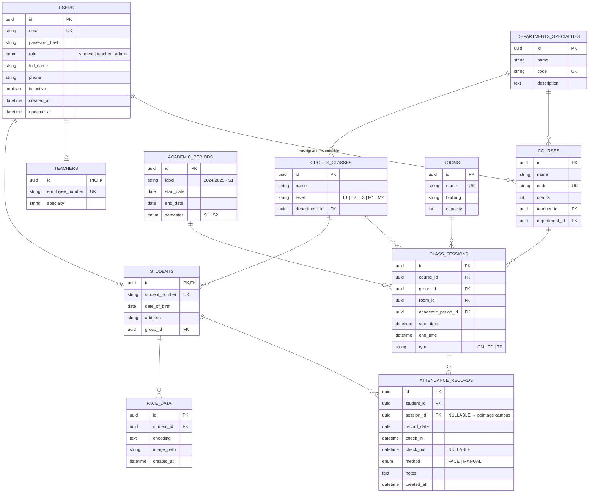
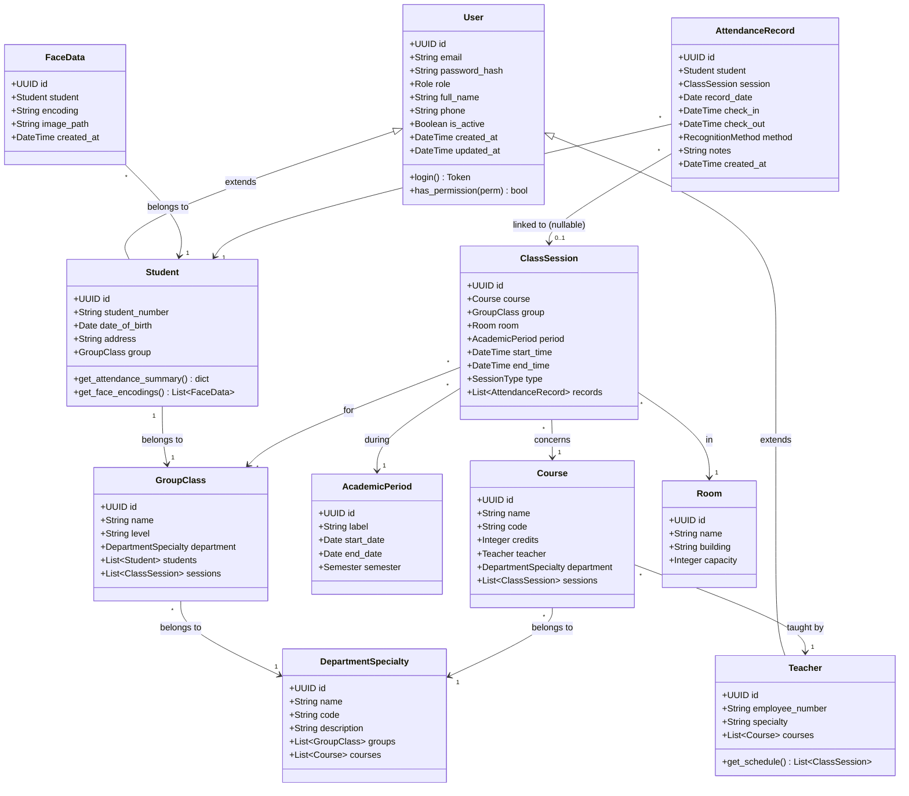

# Schéma de la Base de Données — FaceAttend (Contexte Universitaire)

> Version améliorée avec les suggestions d'intégrité, périodes académiques, salles, et polymorphisme des pointages.

---

## 1. Diagramme MCD (Modèle Conceptuel de Données)



---

## 2. Diagramme de Classes (UML)



---

## 3. Dictionnaire des Tables

### 3.1 `users` — Table unique d'authentification

| Champ | Type | Contraintes | Description |
|-------|------|-------------|-------------|
| id | UUID | PK | Identifiant unique |
| email | VARCHAR(255) | UNIQUE, NOT NULL | Email de connexion |
| password_hash | VARCHAR(255) | NOT NULL | Hash bcrypt du mot de passe |
| role | ENUM | `student`, `teacher`, `admin`, NOT NULL | Rôle dans le système |
| full_name | VARCHAR(255) | NOT NULL | Nom complet |
| phone | VARCHAR(20) | NULLABLE | Téléphone |
| is_active | BOOLEAN | DEFAULT `true` | Soft-delete / désactivation |
| created_at | TIMESTAMPTZ | DEFAULT `now()` | Date de création |
| updated_at | TIMESTAMPTZ | DEFAULT `now()` | Date de modification |

> **Pourquoi une table unique ?** Évite la duplication login/mdp/auth sur 3 tables. Un `admin` n'a pas de profil étudiant ni enseignant. Un `teacher` peut aussi être `student` (doctorant) — un seul compte avec un profil `Teacher`.

---

### 3.2 `students` — Profil étudiant (extension de `users`)

| Champ | Type | Contraintes | Description |
|-------|------|-------------|-------------|
| id | UUID | PK, FK → `users.id` ON DELETE CASCADE | Référence au compte user |
| student_number | VARCHAR(20) | UNIQUE, NOT NULL | Numéro matricule |
| date_of_birth | DATE | NULLABLE | Date de naissance |
| address | TEXT | NULLABLE | Adresse |
| group_id | UUID | FK → `groups_classes.id`, NOT NULL | Groupe/classe d'affectation |

---

### 3.3 `teachers` — Profil enseignant (extension de `users`)

| Champ | Type | Contraintes | Description |
|-------|------|-------------|-------------|
| id | UUID | PK, FK → `users.id` ON DELETE CASCADE | Référence au compte user |
| employee_number | VARCHAR(20) | UNIQUE, NOT NULL | Numéro d'employé |
| specialty | VARCHAR(255) | NULLABLE | Spécialité / domaine |

---

### 3.4 `departments_specialties` — Filières / Départements

| Champ | Type | Contraintes | Description |
|-------|------|-------------|-------------|
| id | UUID | PK | Identifiant unique |
| name | VARCHAR(255) | NOT NULL | Nom (ex: Informatique, Génie Civil) |
| code | VARCHAR(20) | UNIQUE, NOT NULL | Code court (ex: INFO, GC) |
| description | TEXT | NULLABLE | Description optionnelle |

---

### 3.5 `groups_classes` — Niveaux / Groupes

| Champ | Type | Contraintes | Description |
|-------|------|-------------|-------------|
| id | UUID | PK | Identifiant unique |
| name | VARCHAR(255) | NOT NULL | Nom (ex: L2-INFO-A) |
| level | ENUM | `L1`, `L2`, `L3`, `M1`, `M2`, NOT NULL | Niveau d'étude |
| department_id | UUID | FK → `departments_specialties.id`, NOT NULL | Filière de rattachement |

---

### 3.6 `academic_periods` — Périodes académiques (NOUVEAU)

| Champ | Type | Contraintes | Description |
|-------|------|-------------|-------------|
| id | UUID | PK | Identifiant unique |
| label | VARCHAR(100) | NOT NULL | Ex: « 2024/2025 - S1 » |
| start_date | DATE | NOT NULL | Date de début |
| end_date | DATE | NOT NULL | Date de fin |
| semester | ENUM | `S1`, `S2`, NOT NULL | Semestre |

> **Utilité :** permet les rapports par semestre, l'archivage, et de savoir si une séance appartient à une période valide.

---

### 3.7 `courses` — Matières / Cours

| Champ | Type | Contraintes | Description |
|-------|------|-------------|-------------|
| id | UUID | PK | Identifiant unique |
| name | VARCHAR(255) | NOT NULL | Nom du cours |
| code | VARCHAR(20) | UNIQUE, NOT NULL | Code matière (ex: INFO401) |
| credits | INTEGER | DEFAULT `0` | Nombre de crédits ECTS |
| teacher_id | UUID | FK → `users.id`, NOT NULL | Enseignant responsable |
| department_id | UUID | FK → `departments_specialties.id`, NOT NULL | Filière propriétaire du cours |

---

### 3.8 `rooms` — Salles (NOUVEAU)

| Champ | Type | Contraintes | Description |
|-------|------|-------------|-------------|
| id | UUID | PK | Identifiant unique |
| name | VARCHAR(100) | UNIQUE, NOT NULL | Numéro/nom de salle |
| building | VARCHAR(100) | NULLABLE | Bâtiment |
| capacity | INTEGER | DEFAULT `0` | Capacité maximale |

---

### 3.9 `class_sessions` — Séances (Emploi du temps)

| Champ | Type | Contraintes | Description |
|-------|------|-------------|-------------|
| id | UUID | PK | Identifiant unique |
| course_id | UUID | FK → `courses.id`, NOT NULL | Matière concernée |
| group_id | UUID | FK → `groups_classes.id`, NOT NULL | Groupe concerné |
| room_id | UUID | FK → `rooms.id`, NOT NULL | Salle |
| academic_period_id | UUID | FK → `academic_periods.id`, NOT NULL | Période académique |
| start_time | TIMESTAMPTZ | NOT NULL | Début du cours |
| end_time | TIMESTAMPTZ | NOT NULL, CHECK(end_time > start_time) | Fin du cours |
| type | ENUM | `CM`, `TD`, `TP`, NOT NULL | Type de séance |

---

### 3.10 `face_data` — Données biométriques

| Champ | Type | Contraintes | Description |
|-------|------|-------------|-------------|
| id | UUID | PK | Identifiant unique |
| student_id | UUID | FK → `students.id` ON DELETE CASCADE, NOT NULL | Étudiant concerné |
| encoding | TEXT | NOT NULL | Encodage facial (JSON array 128 floats) |
| image_path | VARCHAR(500) | NULLABLE | Chemin de l'image source |
| created_at | TIMESTAMPTZ | DEFAULT `now()` | Date d'enregistrement |

> **Relation :** 1 étudiant → N encodages (plusieurs photos/angles).

---

### 3.11 `attendance_records` — Pointages (table centrale)

| Champ | Type | Contraintes | Description |
|-------|------|-------------|-------------|
| id | UUID | PK | Identifiant unique |
| student_id | UUID | FK → `students.id` ON DELETE CASCADE, NOT NULL | Étudiant pointé |
| session_id | UUID | FK → `class_sessions.id`, **NULLABLE** | NULL = pointage campus, renseigné = pointage cours |
| record_date | DATE | NOT NULL | Date du pointage |
| check_in | TIMESTAMPTZ | NOT NULL | Heure d'arrivée |
| check_out | TIMESTAMPTZ | NULLABLE | Heure de départ (pour campus) |
| method | ENUM | `FACE`, `MANUAL`, NOT NULL | Méthode de reconnaissance |
| notes | TEXT | NULLABLE | Notes optionnelles |
| created_at | TIMESTAMPTZ | DEFAULT `now()` | Date de création |

**Contraintes :**
- `UNIQUE(student_id, session_id)` — pas de doublon par séance
- `UNIQUE(student_id, record_date)` — 1 seul pointage campus par jour
- `CHECK(check_out IS NULL OR check_out > check_in)`
- `CHECK(session_id IS NOT NULL OR ...)` — au moins un contexte défini

> **Polymorphisme du pointage :** une même table gère les deux contextes. Si `session_id` est NULL → c'est une entrée/sortie campus. Sinon → c'est un pointage de cours.

---

## 4. Résumé des relations

```
users (role=student) ── 1:1 ── students ── 1:N ── face_data
                                          ── 1:N ── attendance_records
                                                    |
                                                    └── 0:1 ── class_sessions

users (role=teacher) ── 1:1 ── teachers ── 1:N ── courses

departments_specialties ── 1:N ── groups_classes ── 1:N ── students
                        ── 1:N ── courses

academic_periods ── 1:N ── class_sessions ── 1:N ── attendance_records
courses ── 1:N ── class_sessions
groups_classes ── 1:N ── class_sessions
rooms ── 1:N ── class_sessions
```

---

## 5. Contraintes d'intégrité clés

```sql
-- Pas de doublon de pointage par séance pour un étudiant
UNIQUE (student_id, session_id);

-- Pas de doublon de pointage campus par jour
UNIQUE (student_id, record_date) WHERE session_id IS NULL;

-- Cohérence temporelle
CHECK (check_out IS NULL OR check_out > check_in);

-- Horaires de séance cohérents
CHECK (end_time > start_time);

-- Un étudiant appartient forcément à un groupe
NOT NULL (students.group_id);
```

---

## 6. Améliorations par rapport à la proposition initiale

| Proposition initiale | Version améliorée |
|---|---|
| 3 tables users (Étudiants, Enseignants, Admins) | 1 table `users` avec `role` + extensions `students` / `teachers` |
| Pas de période académique | Table `academic_periods` |
| Salle = champ texte | Table `rooms` |
| Pointage cours / campus = tables séparées ou flou | `session_id NULLABLE` dans `attendance_records` |
| Pas de `check_in` / `check_out` | Colonnes `check_in`, `check_out` avec contrainte |
| Peu de contraintes d'intégrité | `UNIQUE`, `CHECK`, clés étrangères explicites |
