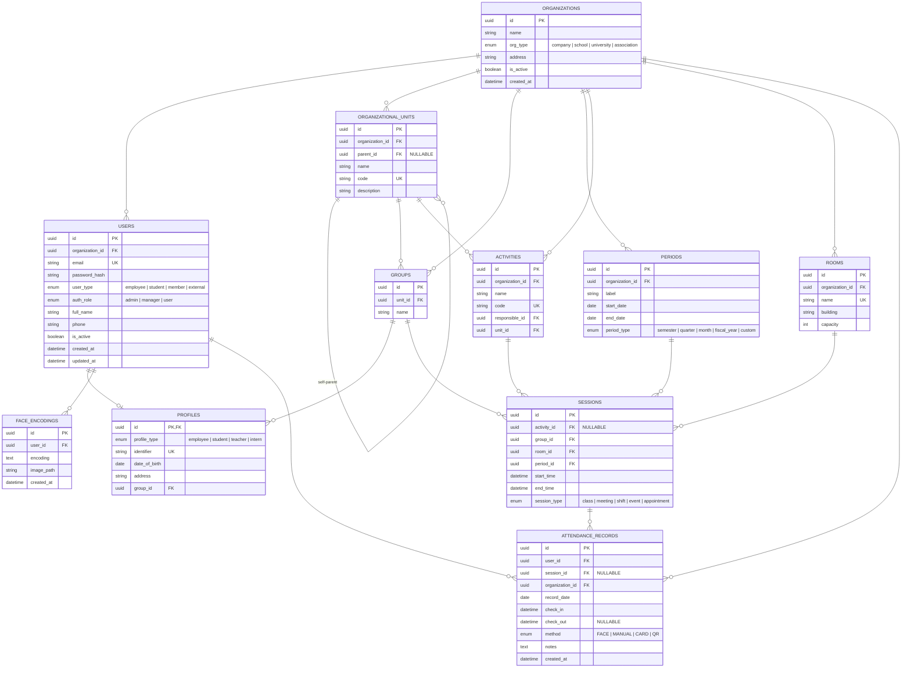
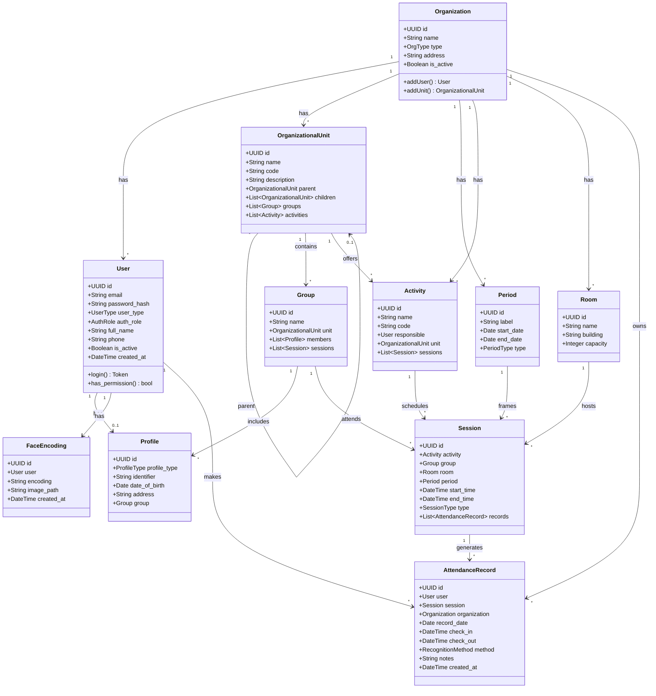

# Schéma Universel — FaceAttend (Entreprise, École, Université, Association)

> Version générique et adaptable. Une même base pour tout type d'organisation.

---

## 1. Diagramme MCD



---

## 2. Diagramme de Classes UML



---

## 3. Dictionnaire des Tables

### 3.1 `organizations` — Organisations (multi-tenant)

**Rôle :** Point d'entrée du multi-tenant. Chaque organisation (entreprise, école, association) est isolée.

**Pourquoi :** Un seul déploiement peut servir plusieurs clients. Chaque organisation a ses propres utilisateurs, unités, salles, sessions.

| Champ | Type | Contraintes | Description |
|-------|------|-------------|-------------|
| id | UUID | PK | |
| name | VARCHAR(255) | NOT NULL | Nom de l'organisation |
| type | ENUM | `company`, `school`, `university`, `association`, NOT NULL | Type |
| address | TEXT | NULLABLE | Adresse |
| is_active | BOOLEAN | DEFAULT `true` | |
| created_at | TIMESTAMPTZ | DEFAULT `now()` | |

---

### 3.2 `users` — Utilisateurs (authentification unique)

**Rôle :** Centralise l'authentification de toutes les personnes, quel que soit leur rôle.

**Pourquoi :** `user_type` dit *qui* (employé, étudiant, membre), `auth_role` dit *ce qu'il peut faire* (admin, manager, user). Séparation claire.

| Champ | Type | Contraintes | Description |
|-------|------|-------------|-------------|
| id | UUID | PK | |
| organization_id | UUID | FK → `organizations.id`, NOT NULL | Organisation de rattachement |
| email | VARCHAR(255) | UNIQUE, NOT NULL | Email de connexion |
| password_hash | VARCHAR(255) | NOT NULL | Hash bcrypt |
| user_type | ENUM | `employee`, `student`, `member`, `external`, NOT NULL | Nature de la personne |
| auth_role | ENUM | `admin`, `manager`, `user`, NOT NULL | Permission |
| full_name | VARCHAR(255) | NOT NULL | |
| phone | VARCHAR(20) | NULLABLE | |
| is_active | BOOLEAN | DEFAULT `true` | |
| created_at | TIMESTAMPTZ | DEFAULT `now()` | |
| updated_at | TIMESTAMPTZ | DEFAULT `now()` | |

---

### 3.3 `profiles` — Profils (extension de `users`)

**Rôle :** Porte les champs spécifiques selon le type de personne (matricule étudiant, numéro employé, date naissance).

**Pourquoi :** Une table unique au lieu de `students` + `teachers` séparés. Le `profile_type` fait la distinction.

| Champ | Type | Contraintes | Description |
|-------|------|-------------|-------------|
| id | UUID | PK, FK → `users.id` ON DELETE CASCADE | |
| profile_type | ENUM | `employee`, `student`, `teacher`, `intern`, NOT NULL | Type de profil |
| identifier | VARCHAR(20) | UNIQUE, NOT NULL | Matricule étudiant / employé |
| date_of_birth | DATE | NULLABLE | |
| address | TEXT | NULLABLE | |
| group_id | UUID | FK → `groups.id`, NOT NULL | Groupe d'affectation |

---

### 3.4 `organizational_units` — Unités organisationnelles

**Rôle :** Structure hiérarchique (ex: Université → Faculté → Département, ou Entreprise → Direction → Service).

**Pourquoi :** Le `parent_id` permet une arborescence infinie. Filtrage des rapports par unité.

| Champ | Type | Contraintes | Description |
|-------|------|-------------|-------------|
| id | UUID | PK | |
| organization_id | UUID | FK → `organizations.id`, NOT NULL | |
| parent_id | UUID | FK → `organizational_units.id`, NULLABLE | Unité parente |
| name | VARCHAR(255) | NOT NULL | |
| code | VARCHAR(20) | UNIQUE, NOT NULL | Code court |
| description | TEXT | NULLABLE | |

---

### 3.5 `groups` — Groupes

**Rôle :** Regroupe les membres (ex: équipe projet, classe L2-INFO-A, département RH).

**Pourquoi :** Les sessions et les profils sont liés à un groupe. Simple et universel.

| Champ | Type | Contraintes | Description |
|-------|------|-------------|-------------|
| id | UUID | PK | |
| unit_id | UUID | FK → `organizational_units.id`, NOT NULL | Unité de rattachement |
| name | VARCHAR(255) | NOT NULL | Nom du groupe |

---

### 3.6 `periods` — Périodes

**Rôle :** Définit les intervalles de temps (semestre, trimestre, mois, année fiscale).

**Pourquoi :** Universel — une entreprise utilise des trimestres, une école des semestres.

| Champ | Type | Contraintes | Description |
|-------|------|-------------|-------------|
| id | UUID | PK | |
| organization_id | UUID | FK → `organizations.id`, NOT NULL | |
| label | VARCHAR(100) | NOT NULL | Ex: « 2025-T1 », « S1 2024/2025 » |
| start_date | DATE | NOT NULL | |
| end_date | DATE | NOT NULL | |
| period_type | ENUM | `semester`, `quarter`, `month`, `fiscal_year`, `custom`, NOT NULL | Type |

---

### 3.7 `activities` — Activités

**Rôle :** Tout ce qui peut être planifié (cours, réunion, projet, shift).

**Pourquoi :** « Cours » n'existe pas en entreprise. « Activité » est universel.

| Champ | Type | Contraintes | Description |
|-------|------|-------------|-------------|
| id | UUID | PK | |
| organization_id | UUID | FK → `organizations.id`, NOT NULL | |
| name | VARCHAR(255) | NOT NULL | Nom |
| code | VARCHAR(20) | UNIQUE, NOT NULL | Code |
| responsible_id | UUID | FK → `users.id`, NOT NULL | Responsable |
| unit_id | UUID | FK → `organizational_units.id`, NOT NULL | Unité propriétaire |

---

### 3.8 `rooms` — Salles / Lieux

**Rôle :** Lieux physiques (salle de classe, bureau, amphithéâtre, salle de réunion).

**Pourquoi :** Indispensable pour éviter les conflits d'occupation.

| Champ | Type | Contraintes | Description |
|-------|------|-------------|-------------|
| id | UUID | PK | |
| organization_id | UUID | FK → `organizations.id`, NOT NULL | |
| name | VARCHAR(100) | UNIQUE, NOT NULL | |
| building | VARCHAR(100) | NULLABLE | Bâtiment |
| capacity | INTEGER | DEFAULT `0` | |

---

### 3.9 `sessions` — Sessions (planning)

**Rôle :** Chaque ligne = un événement planifié (cours, réunion, shift, événement).

**Pourquoi :** Pivot entre activité, groupe, salle, période. Le `activity_id` est NULLABLE pour les sessions sans activité (ex: événement général).

| Champ | Type | Contraintes | Description |
|-------|------|-------------|-------------|
| id | UUID | PK | |
| activity_id | UUID | FK → `activities.id`, NULLABLE | NULL si événement général |
| group_id | UUID | FK → `groups.id`, NOT NULL | Groupe concerné |
| room_id | UUID | FK → `rooms.id`, NOT NULL | |
| period_id | UUID | FK → `periods.id`, NOT NULL | |
| start_time | TIMESTAMPTZ | NOT NULL | |
| end_time | TIMESTAMPTZ | NOT NULL, CHECK(end_time > start_time) | |
| session_type | ENUM | `class`, `meeting`, `shift`, `event`, `appointment`, NOT NULL | Type |

---

### 3.10 `face_encodings` — Données faciales

**Rôle :** Encodages biométriques pour la reconnaissance faciale.

**Pourquoi :** Lié à `users` et non à `profiles` — un enseignant ou un admin peut aussi utiliser la reconnaissance.

| Champ | Type | Contraintes | Description |
|-------|------|-------------|-------------|
| id | UUID | PK | |
| user_id | UUID | FK → `users.id` ON DELETE CASCADE, NOT NULL | |
| encoding | TEXT | NOT NULL | JSON array 128 floats |
| image_path | VARCHAR(500) | NULLABLE | |
| created_at | TIMESTAMPTZ | DEFAULT `now()` | |

---

### 3.11 `attendance_records` — Pointages (table centrale)

**Rôle :** Enregistre chaque présence (cours, réunion, entrée/sortie).

**Pourquoi :** Table centrale. `session_id` NULL = pointage libre (entrée/sortie). Renseigné = pointage lié à un événement. Lié à `users` pour être universel.

| Champ | Type | Contraintes | Description |
|-------|------|-------------|-------------|
| id | UUID | PK | |
| user_id | UUID | FK → `users.id` ON DELETE CASCADE, NOT NULL | Personne pointée |
| session_id | UUID | FK → `sessions.id`, NULLABLE | NULL = libre, renseigné = événement |
| organization_id | UUID | FK → `organizations.id`, NOT NULL | |
| record_date | DATE | NOT NULL | |
| check_in | TIMESTAMPTZ | NOT NULL | |
| check_out | TIMESTAMPTZ | NULLABLE | |
| method | ENUM | `FACE`, `MANUAL`, `CARD`, `QR`, NOT NULL | Méthode |
| notes | TEXT | NULLABLE | |
| created_at | TIMESTAMPTZ | DEFAULT `now()` | |

**Contraintes :**
- `UNIQUE(user_id, session_id)` — pas de doublon par session
- `UNIQUE(user_id, record_date)` — 1 seul pointage libre par jour
- `CHECK(check_out IS NULL OR check_out > check_in)`

---

## 4. Correspondance : Ancien (Universitaire) → Nouveau (Universel)

| Universitaire (v1) | Universel (v2) | Pourquoi |
|---|---|---|
| — | `organizations` | Multi-tenant |
| `users.role = student/teacher/admin` | `users.user_type` + `users.auth_role` | Qui vs permissions |
| `students` + `teachers` | `profiles` avec `profile_type` | 1 table au lieu de 2 |
| `departments_specialties` | `organizational_units` avec `parent_id` | Hiérarchie infinie |
| `groups_classes` + `level` | `groups` | Plus de niveau figé |
| `academic_periods` + `semester` | `periods` avec `period_type` | Trimestre, mois, année fiscale |
| `courses` + `credits` | `activities` | Universel |
| `rooms` | `rooms` + `organization_id` | Multi-tenant |
| `class_sessions` + `CM/TD/TP` | `sessions` + `session_type` | Meeting, shift, event |
| `face_data` → lié à `students` | `face_encodings` → lié à `users` | Tout le monde peut utiliser la RF |
| `attendance_records` → lié à `students` | `attendance_records` → lié à `users` | Employés aussi |

---

## 5. Contraintes d'intégrité

```sql
-- Isolation multi-tenant (toutes les tables ont organization_id)
-- Pas de doublon par session
UNIQUE (user_id, session_id);
-- Pas de doublon de pointage libre par jour
UNIQUE (user_id, record_date) WHERE session_id IS NULL;
-- Cohérence temporelle
CHECK (check_out IS NULL OR check_out > check_in);
-- Horaires cohérents
CHECK (end_time > start_time);
-- Hiérarchie: une unité ne peut pas être son propre parent
CHECK (parent_id != id);
```

---

## 6. Cas d'usage concrets

| Organisation | `user_type` | `activity` | `session_type` |
|---|---|---|---|
| **Université** | student, teacher | Algèbre, Réseaux | class |
| **Entreprise** | employee | Réunion d'équipe, Shift de prod | meeting, shift |
| **École primaire** | student, teacher | Math, Français | class |
| **Association** | member | Assemblée générale, Atelier | event, meeting |
| **Hôpital** | employee, external | Garde A, Staff | shift, meeting |

Le **moteur de pointage** (reconnaissance faciale → écriture dans `attendance_records`) est **exactement le même** pour tous ces cas. Seule la configuration des activités et des sessions change.
