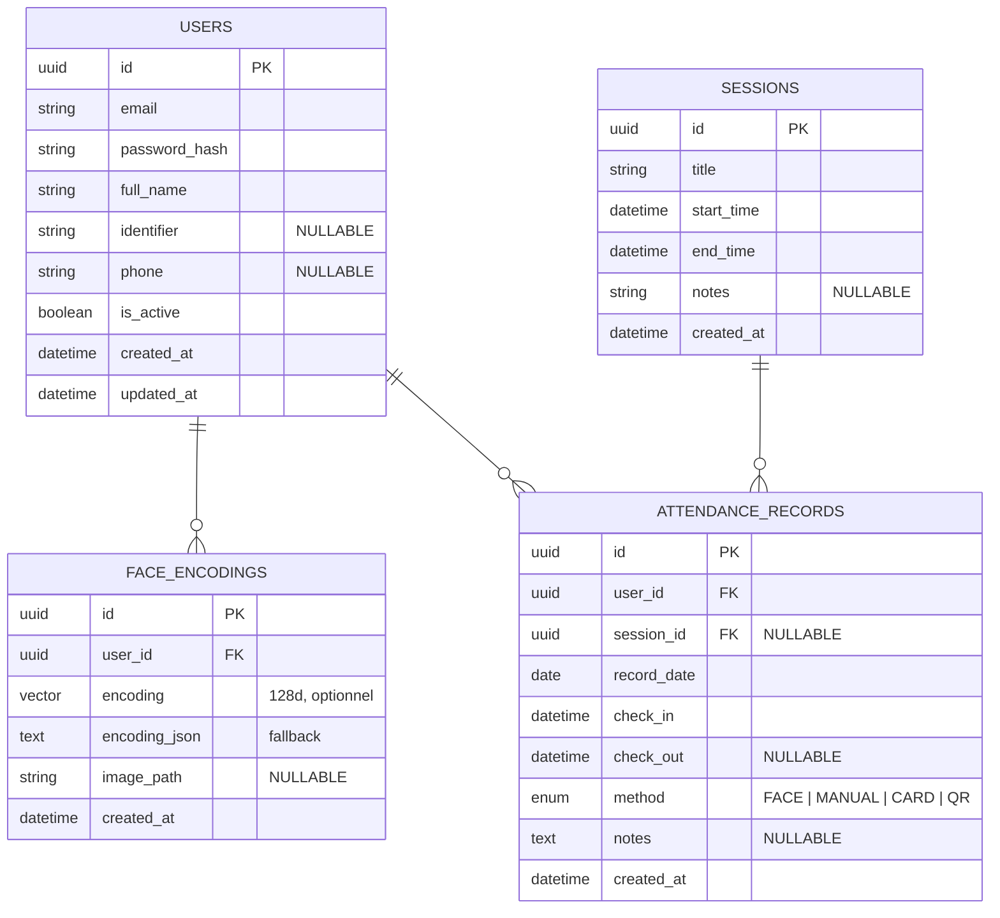

# Schéma — Modèle de reconnaissance faciale dédié à la gestion du pointage et de la présence

> Version minimaliste et ciblée. 4 tables, zéro multi-tenant, zéro hiérarchie.

---

## 1. Diagramme MCD



---

## 2. Dictionnaire des Tables

### 2.1 `users` — Utilisateurs

**Rôle :** Toute personne pouvant pointer par reconnaissance faciale. Fusionne les anciennes tables `users` + `profiles`.

| Champ | Type | Contraintes | Description |
|-------|------|-------------|-------------|
| id | UUID | PK | |
| email | VARCHAR(255) | NOT NULL, UNIQUE | Email de connexion |
| password_hash | VARCHAR(255) | NOT NULL | Hash bcrypt |
| full_name | VARCHAR(255) | NOT NULL | Nom complet |
| identifier | VARCHAR(20) | NULLABLE, UNIQUE | Matricule étudiant / employé |
| phone | VARCHAR(20) | NULLABLE | Téléphone |
| is_active | BOOLEAN | DEFAULT `true` | Soft-delete |
| created_at | TIMESTAMPTZ | DEFAULT `now()` | |
| updated_at | TIMESTAMPTZ | DEFAULT `now()` | |

---

### 2.2 `sessions` — Sessions (planning)

**Rôle :** Événements planifiés auxquels les utilisateurs peuvent pointer (cours, réunion, shift).

| Champ | Type | Contraintes | Description |
|-------|------|-------------|-------------|
| id | UUID | PK | |
| title | VARCHAR(255) | NOT NULL | Intitulé (ex: « Cours Algèbre », « Réunion d'équipe ») |
| start_time | TIMESTAMPTZ | NOT NULL | Début |
| end_time | TIMESTAMPTZ | NOT NULL, CHECK(end_time > start_time) | Fin |
| notes | TEXT | NULLABLE | Description ou information complémentaire |
| created_at | TIMESTAMPTZ | DEFAULT `now()` | |

**Index :**
- `INDEX(start_time, end_time)`

---

### 2.3 `face_encodings` — Données faciales

**Rôle :** Encodages biométriques pour la reconnaissance faciale.

| Champ | Type | Contraintes | Description |
|-------|------|-------------|-------------|
| id | UUID | PK | |
| user_id | UUID | FK → `users.id` ON DELETE CASCADE, NOT NULL | |
| encoding | VECTOR(128) | NULLABLE | Vecteur pgvector pour recherche de similarité native |
| encoding_json | TEXT | NULLABLE | Fallback JSON pour les bases sans pgvector |
| image_path | VARCHAR(500) | NULLABLE | Chemin de l'image source |
| created_at | TIMESTAMPTZ | DEFAULT `now()` | |

> **Note :** `encoding` (VECTOR) est l'option recommandée avec l'extension PostgreSQL `pgvector`. `encoding_json` sert de fallback. Au moins un des deux doit être renseigné.

**Index :**
- `INDEX(user_id)`

---

### 2.4 `attendance_records` — Pointages (table centrale)

**Rôle :** Table la plus importante. Chaque ligne représente une détection de présence.

| Champ | Type | Contraintes | Description |
|-------|------|-------------|-------------|
| id | UUID | PK | |
| user_id | UUID | FK → `users.id` ON DELETE CASCADE, NOT NULL | Personne pointée |
| session_id | UUID | FK → `sessions.id`, NULLABLE | NULL = pointage libre, renseigné = événement |
| record_date | DATE | NOT NULL | Date du pointage (dénormalisée pour les rapports) |
| check_in | TIMESTAMPTZ | NOT NULL | Heure d'arrivée |
| check_out | TIMESTAMPTZ | NULLABLE | Heure de départ |
| method | ENUM | `FACE`, `MANUAL`, `CARD`, `QR`, NOT NULL | Méthode de pointage |
| notes | TEXT | NULLABLE | |
| created_at | TIMESTAMPTZ | DEFAULT `now()` | |

**Contraintes :**
- `UNIQUE(user_id, session_id)` — pas de double pointage par session
- `UNIQUE(user_id, record_date) WHERE session_id IS NULL` — 1 seul pointage libre par jour
- `CHECK(check_out IS NULL OR check_out > check_in)`

**Index :**
- `INDEX(record_date)` — rapports quotidiens/mensuels
- `INDEX(user_id, record_date)` — historique utilisateur
- `INDEX(session_id)` — pointages par session

---

## 3. Ce qui a été supprimé et pourquoi

| Table supprimée | Raison |
|---|---|
| `organizations` | Pas de multi-tenant. Système dédié à une seule organisation. |
| `profiles` | Fusionné dans `users` : les champs supplémentaires (identifiant, téléphone) sont directement dans `users`. |
| `organizational_units` | Hiérarchie superflue pour un système de pointage ciblé. |
| `groups` | La gestion de groupes peut être faite en applicatif ou via un champ `group` dans `users` si nécessaire. |
| `periods` | Les sessions ont des dates de début/fin explicites, pas besoin de période agrégée. |
| `activities` | Simplifié : une session a un titre, pas besoin d'une table activité séparée. |
| `rooms` | Non nécessaire pour le pointage. Peut être un champ texte dans `sessions` si besoin. |

---

## 4. Cas d'usage

| Scénario | `sessions` | Pointage |
|---|---|---|
| **Cours universitaire** | title="Algèbre S2", start=08:00, end=10:00 | Lié à la session |
| **Entrée/sortie entreprise** | NULL (pointage libre) | session_id = NULL |
| **Réunion d'équipe** | title="Réunion sprint", start=14:00, end=15:00 | Lié à la session |
| **Shift d'usine** | title="Shift matin", start=06:00, end=14:00 | Lié à la session |

---

## 5. Index de performance

```sql
CREATE INDEX idx_attendance_date ON attendance_records(record_date);
CREATE INDEX idx_attendance_user_date ON attendance_records(user_id, record_date);
CREATE INDEX idx_attendance_session ON attendance_records(session_id);
CREATE INDEX idx_face_user ON face_encodings(user_id);
CREATE INDEX idx_sessions_time ON sessions(start_time, end_time);
```

---

## 6. Contraintes d'intégrité

```sql
-- Unicité des pointages
CREATE UNIQUE INDEX uq_user_session ON attendance_records(user_id, session_id);
CREATE UNIQUE INDEX uq_user_date_free ON attendance_records(user_id, record_date)
    WHERE session_id IS NULL;

-- Cohérence temporelle
CHECK (check_out IS NULL OR check_out > check_in);
CHECK (end_time > start_time);

-- Soft-delete
-- is_active présent sur users seulement
```
