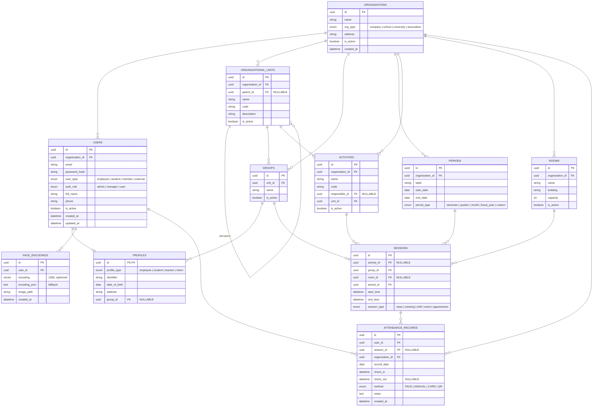
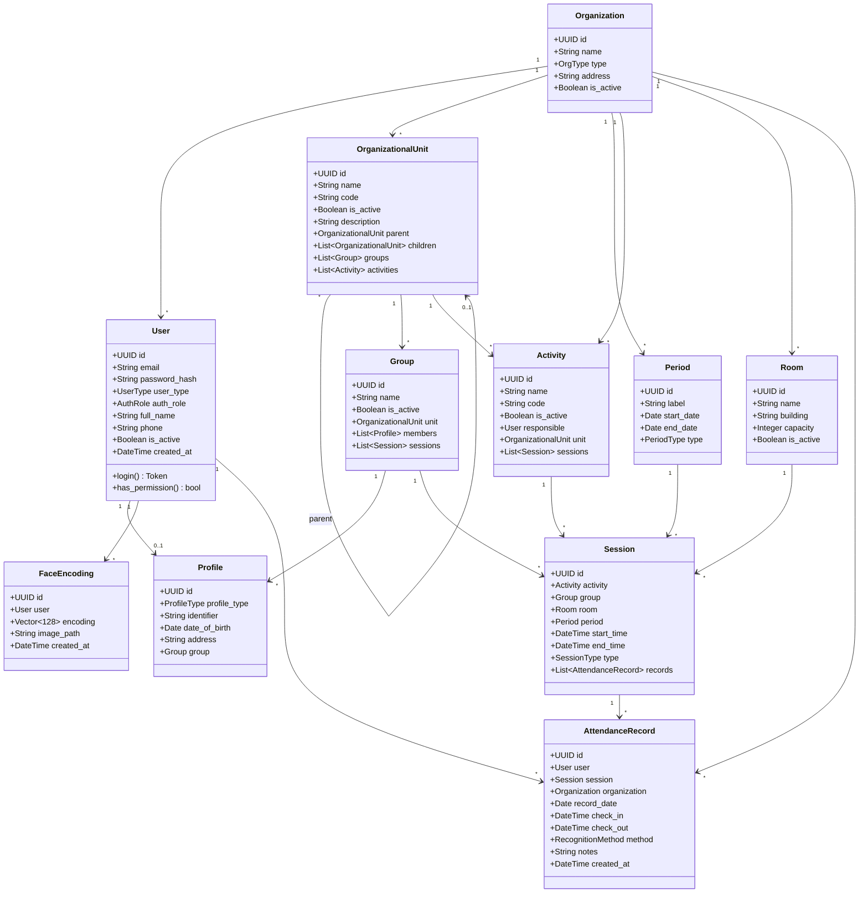

# Schéma Universel — FaceAttend (Entreprise, École, Université, Association)

> Version générique et adaptable. Une même base pour tout type d'organisation.

---

## 1. Diagramme MCD



---

## 2. Diagramme de Classes UML



---

## 3. Dictionnaire des Tables

### 3.1 `organizations` — Organisations (multi-tenant)

**Rôle :** Point d'entrée du multi-tenant. Chaque organisation (entreprise, école, association) est isolée.

**Pourquoi :** Un seul déploiement peut servir plusieurs clients. Chaque organisation a ses propres utilisateurs, unités, salles, sessions.

| Champ | Type | Contraintes | Description |
|-------|------|-------------|-------------|
| id | UUID | PK | |
| name | VARCHAR(255) | NOT NULL | Nom de l'organisation |
| type | ENUM | `company`, `school`, `university`, `association`, NOT NULL | Type |
| address | TEXT | NULLABLE | Adresse |
| is_active | BOOLEAN | DEFAULT `true` | Soft-delete |
| created_at | TIMESTAMPTZ | DEFAULT `now()` | |

---

### 3.2 `users` — Utilisateurs (authentification unique)

**Rôle :** Centralise l'authentification de toutes les personnes, quel que soit leur rôle.

**Pourquoi :** `user_type` dit *qui* (employé, étudiant, membre), `auth_role` dit *ce qu'il peut faire* (admin, manager, user). Séparation claire.

| Champ | Type | Contraintes | Description |
|-------|------|-------------|-------------|
| id | UUID | PK | |
| organization_id | UUID | FK → `organizations.id`, NOT NULL | Organisation de rattachement |
| email | VARCHAR(255) | NOT NULL | Email de connexion |
| password_hash | VARCHAR(255) | NOT NULL | Hash bcrypt |
| user_type | ENUM | `employee`, `student`, `member`, `external`, NOT NULL | Nature de la personne |
| auth_role | ENUM | `admin`, `manager`, `user`, NOT NULL | Permission |
| full_name | VARCHAR(255) | NOT NULL | |
| phone | VARCHAR(20) | NULLABLE | |
| is_active | BOOLEAN | DEFAULT `true` | |
| created_at | TIMESTAMPTZ | DEFAULT `now()` | |
| updated_at | TIMESTAMPTZ | DEFAULT `now()` | |

**Contraintes :**
- `UNIQUE(organization_id, email)` — un email par organisation (deux organisations différentes peuvent avoir `admin@local`)

**Index :**
- `INDEX(organization_id, email)`

---

### 3.3 `profiles` — Profils (extension de `users`)

**Rôle :** Porte les champs spécifiques selon le type de personne (matricule étudiant, numéro employé, date naissance).

**Pourquoi :** Une table unique au lieu de `students` + `teachers` séparés. Le `profile_type` fait la distinction.

| Champ | Type | Contraintes | Description |
|-------|------|-------------|-------------|
| id | UUID | PK, FK → `users.id` ON DELETE CASCADE | |
| profile_type | ENUM | `employee`, `student`, `teacher`, `intern`, NOT NULL | Type de profil |
| identifier | VARCHAR(20) | NOT NULL | Matricule étudiant / employé |
| date_of_birth | DATE | NULLABLE | |
| address | TEXT | NULLABLE | |
| group_id | UUID | FK → `groups.id`, NULLABLE | Groupe d'affectation |

**Contraintes :**
- `UNIQUE(organization_id, identifier)` — l'unicité du matricule est par organisation (nécessite une jointure ou dénormalisation de `organization_id`)
- `group_id` NULLABLE : un admin ou un externe n'a pas forcément de groupe

---

### 3.4 `organizational_units` — Unités organisationnelles

**Rôle :** Structure hiérarchique (ex: Université → Faculté → Département, ou Entreprise → Direction → Service).

**Pourquoi :** Le `parent_id` permet une arborescence infinie. Filtrage des rapports par unité.

| Champ | Type | Contraintes | Description |
|-------|------|-------------|-------------|
| id | UUID | PK | |
| organization_id | UUID | FK → `organizations.id`, NOT NULL | |
| parent_id | UUID | FK → `organizational_units.id`, NULLABLE | Unité parente |
| name | VARCHAR(255) | NOT NULL | |
| code | VARCHAR(20) | NOT NULL | Code court |
| description | TEXT | NULLABLE | |
| is_active | BOOLEAN | DEFAULT `true` | Soft-delete |

**Contraintes :**
- `UNIQUE(organization_id, code)`
- `CHECK(parent_id != id)` — pas d'auto-référence directe (les cycles indirects sont gérés en applicatif)

**Index :**
- `INDEX(organization_id, parent_id)`

---

### 3.5 `groups` — Groupes

**Rôle :** Regroupe les membres (ex: équipe projet, classe L2-INFO-A, département RH).

**Pourquoi :** Les sessions et les profils sont liés à un groupe. Simple et universel.

| Champ | Type | Contraintes | Description |
|-------|------|-------------|-------------|
| id | UUID | PK | |
| unit_id | UUID | FK → `organizational_units.id`, NOT NULL | Unité de rattachement |
| name | VARCHAR(255) | NOT NULL | Nom du groupe |
| is_active | BOOLEAN | DEFAULT `true` | Soft-delete |

**Index :**
- `INDEX(unit_id)`

---

### 3.6 `periods` — Périodes

**Rôle :** Définit les intervalles de temps (semestre, trimestre, mois, année fiscale).

**Pourquoi :** Universel — une entreprise utilise des trimestres, une école des semestres.

| Champ | Type | Contraintes | Description |
|-------|------|-------------|-------------|
| id | UUID | PK | |
| organization_id | UUID | FK → `organizations.id`, NOT NULL | |
| label | VARCHAR(100) | NOT NULL | Ex: « 2025-T1 », « S1 2024/2025 » |
| start_date | DATE | NOT NULL | |
| end_date | DATE | NOT NULL, CHECK(end_date > start_date) | |
| period_type | ENUM | `semester`, `quarter`, `month`, `fiscal_year`, `custom`, NOT NULL | Type |

---

### 3.7 `activities` — Activités

**Rôle :** Tout ce qui peut être planifié (cours, réunion, projet, shift).

**Pourquoi :** « Cours » n'existe pas en entreprise. « Activité » est universel.

| Champ | Type | Contraintes | Description |
|-------|------|-------------|-------------|
| id | UUID | PK | |
| organization_id | UUID | FK → `organizations.id`, NOT NULL | |
| name | VARCHAR(255) | NOT NULL | Nom |
| code | VARCHAR(20) | NOT NULL | Code |
| responsible_id | UUID | FK → `users.id`, NULLABLE | Responsable (optionnel) |
| unit_id | UUID | FK → `organizational_units.id`, NOT NULL | Unité propriétaire |
| is_active | BOOLEAN | DEFAULT `true` | Soft-delete |

**Contraintes :**
- `UNIQUE(organization_id, code)`

---

### 3.8 `rooms` — Salles / Lieux

**Rôle :** Lieux physiques (salle de classe, bureau, amphithéâtre, salle de réunion).

**Pourquoi :** Indispensable pour éviter les conflits d'occupation.

| Champ | Type | Contraintes | Description |
|-------|------|-------------|-------------|
| id | UUID | PK | |
| organization_id | UUID | FK → `organizations.id`, NOT NULL | |
| name | VARCHAR(100) | NOT NULL | |
| building | VARCHAR(100) | NULLABLE | Bâtiment |
| capacity | INTEGER | DEFAULT `0` | |
| is_active | BOOLEAN | DEFAULT `true` | Soft-delete |

**Contraintes :**
- `UNIQUE(organization_id, name)`

---

### 3.9 `sessions` — Sessions (planning)

**Rôle :** Chaque ligne = un événement planifié (cours, réunion, shift, événement).

**Pourquoi :** Pivot entre activité, groupe, salle, période.

| Champ | Type | Contraintes | Description |
|-------|------|-------------|-------------|
| id | UUID | PK | |
| activity_id | UUID | FK → `activities.id`, NULLABLE | NULL si événement général |
| group_id | UUID | FK → `groups.id`, NOT NULL | Groupe concerné |
| room_id | UUID | FK → `rooms.id`, NULLABLE | NULL si distanciel (visio, télétravail) |
| period_id | UUID | FK → `periods.id`, NOT NULL | |
| start_time | TIMESTAMPTZ | NOT NULL | |
| end_time | TIMESTAMPTZ | NOT NULL, CHECK(end_time > start_time) | |
| session_type | ENUM | `class`, `meeting`, `shift`, `event`, `appointment`, NOT NULL | Type |

**Index :**
- `INDEX(room_id, start_time, end_time)` — détection conflits
- `INDEX(period_id)`
- `INDEX(group_id)`

---

### 3.10 `face_encodings` — Données faciales

**Rôle :** Encodages biométriques pour la reconnaissance faciale.

**Pourquoi :** Lié à `users` et non à `profiles` — tout le monde peut utiliser la reconnaissance.

| Champ | Type | Contraintes | Description |
|-------|------|-------------|-------------|
| id | UUID | PK | |
| user_id | UUID | FK → `users.id` ON DELETE CASCADE, NOT NULL | |
| encoding | VECTOR(128) | NULLABLE | Vecteur pgvector pour recherche de similarité native |
| encoding_json | TEXT | NULLABLE | Fallback JSON pour les bases sans pgvector |
| image_path | VARCHAR(500) | NULLABLE | |
| created_at | TIMESTAMPTZ | DEFAULT `now()` | |

> **Note :** `encoding` (VECTOR) est l'option recommandée en production avec l'extension PostgreSQL `pgvector`. `encoding_json` sert de fallback si pgvector n'est pas disponible. Au moins un des deux doit être renseigné.

---

### 3.11 `attendance_records` — Pointages (table centrale)

**Rôle :** Table la plus importante. Chaque ligne représente une détection de présence.

**Pourquoi :** `session_id` NULL = pointage libre (entrée/sortie). Renseigné = pointage lié à un événement. Lié à `users` pour être universel.

| Champ | Type | Contraintes | Description |
|-------|------|-------------|-------------|
| id | UUID | PK | |
| user_id | UUID | FK → `users.id` ON DELETE CASCADE, NOT NULL | Personne pointée |
| session_id | UUID | FK → `sessions.id`, NULLABLE | NULL = pointage libre, renseigné = événement |
| organization_id | UUID | FK → `organizations.id`, NOT NULL | |
| record_date | DATE | NOT NULL | |
| check_in | TIMESTAMPTZ | NOT NULL | |
| check_out | TIMESTAMPTZ | NULLABLE | |
| method | ENUM | `FACE`, `MANUAL`, `CARD`, `QR`, NOT NULL | Méthode |
| notes | TEXT | NULLABLE | |
| created_at | TIMESTAMPTZ | DEFAULT `now()` | |

**Contraintes :**
- `UNIQUE(user_id, session_id)` — pas de doublon par session
- `UNIQUE(user_id, record_date) WHERE session_id IS NULL` — 1 seul pointage libre par jour (cette contrainte partielle n'interdit pas un pointage libre ET un pointage de session le même jour)
- `CHECK(check_out IS NULL OR check_out > check_in)`

**Index :**
- `INDEX(organization_id, record_date)` — rapports quotidiens/mensuels
- `INDEX(user_id, record_date)`
- `INDEX(session_id)`

---

## 4. Correspondance : Ancien (Universitaire) → Nouveau (Universel)

| Universitaire (v1) | Universel (v2) | Pourquoi |
|---|---|---|
| — | `organizations` | Multi-tenant |
| `users.role` | `users.user_type` + `users.auth_role` | Qui vs permissions |
| `students` + `teachers` | `profiles` avec `profile_type` | 1 table au lieu de 2 |
| `departments_specialties` | `organizational_units` avec `parent_id` | Hiérarchie infinie |
| `groups_classes` + `level` | `groups` | Plus de niveau figé |
| `academic_periods` + `semester` | `periods` avec `period_type` | Trimestre, mois, année fiscale |
| `courses` + `credits` | `activities` | Universel |
| `rooms` | `rooms` + `organization_id` | Multi-tenant |
| `class_sessions` + `CM/TD/TP` | `sessions` + `session_type` | Meeting, shift, event |
| `face_data` → lié à `students` | `face_encodings` → lié à `users` | Tout le monde peut utiliser la RF |
| `attendance_records` → lié à `students` | `attendance_records` → lié à `users` | Employés aussi |

---

## 5. Contraintes d'intégrité

```sql
-- ========== MULTI-TENANT : UNIQUES par organisation ==========
CREATE UNIQUE INDEX uq_org_email ON users(organization_id, email);
CREATE UNIQUE INDEX uq_org_identifier ON profiles(organization_id, identifier);
CREATE UNIQUE INDEX uq_org_code ON organizational_units(organization_id, code);
CREATE UNIQUE INDEX uq_org_code ON activities(organization_id, code);
CREATE UNIQUE INDEX uq_org_name ON rooms(organization_id, name);

-- ========== POINTAGES ==========
CREATE UNIQUE INDEX uq_user_session ON attendance_records(user_id, session_id);
CREATE UNIQUE INDEX uq_user_date_free ON attendance_records(user_id, record_date)
    WHERE session_id IS NULL;

-- ========== COHÉRENCE TEMPORELLE ==========
CHECK (check_out IS NULL OR check_out > check_in);
CHECK (end_time > start_time);
CHECK (periods.end_date > periods.start_date);

-- ========== HIÉRARCHIE ==========
CHECK (parent_id != id);  -- anti-cycle direct
-- Les cycles indirects sont détectés en applicatif

-- ========== SOFT-DELETE ==========
-- is_active présent sur : organizations, users, rooms, activities, groups, organizational_units
```

---

## 6. Index de performance

```sql
CREATE INDEX idx_attendance_org_date ON attendance_records(organization_id, record_date);
CREATE INDEX idx_attendance_user_date ON attendance_records(user_id, record_date);
CREATE INDEX idx_attendance_session ON attendance_records(session_id);
CREATE INDEX idx_sessions_room_time ON sessions(room_id, start_time, end_time);
CREATE INDEX idx_sessions_period ON sessions(period_id);
CREATE INDEX idx_sessions_group ON sessions(group_id);
CREATE INDEX idx_users_org_email ON users(organization_id, email);
CREATE INDEX idx_units_org_parent ON organizational_units(organization_id, parent_id);
CREATE INDEX idx_groups_unit ON groups(unit_id);
CREATE INDEX idx_activities_org ON activities(organization_id);
```

---

## 7. Cas d'usage concrets

| Organisation | `user_type` | `activity` | `session_type` | `room_id` |
|---|---|---|---|---|
| **Université** | student, teacher | Algèbre, Réseaux | class | Amphi 3 (NOT NULL) |
| **Entreprise** | employee | Réunion d'équipe, Shift prod | meeting, shift | Salle A ou NULL (télétravail) |
| **École primaire** | student, teacher | Math, Français | class | Salle 101 |
| **Association** | member | Assemblée générale, Atelier | event, meeting | NULL (en ligne) |
| **Hôpital** | employee, external | Garde A, Staff | shift, meeting | NULL (pas de salle fixe) |

Le **moteur de pointage** (reconnaissance faciale → écriture dans `attendance_records`) est **exactement le même** pour tous ces cas. Seule la configuration des activités et des sessions change.

---

## 8. Errata — Corrections appliquées à cette version

| # | Problème identifié | Correction |
|---|---|---|
| 1 | `profiles.identifier` UNIQUE global | `UNIQUE(organization_id, identifier)` |
| 2 | `rooms.name` UNIQUE global | `UNIQUE(organization_id, name)` |
| 3 | `activities.code` UNIQUE global | `UNIQUE(organization_id, code)` |
| 4 | `organizational_units.code` UNIQUE global | `UNIQUE(organization_id, code)` |
| 5 | Contrainte `UNIQUE(user_id, record_date)` sans `WHERE` dans §3.11 | Ajout de `WHERE session_id IS NULL` dans le tableau et le SQL |
| 6 | `profiles.group_id NOT NULL` trop rigide | Passage en `NULLABLE` |
| 7 | `activities.responsible_id NOT NULL` trop rigide | Passage en `NULLABLE` |
| 8 | `sessions.room_id NOT NULL` bloque le distanciel | Passage en `NULLABLE` |
| 9 | `email` UNIQUE global | `UNIQUE(organization_id, email)` |
| 10 | Pas d'index explicites | Ajout de tous les index de performance (§6) |
| 11 | Pas de soft-delete sur toutes les tables | Ajout de `is_active` sur `organizational_units`, `groups`, `activities`, `rooms` |
| 12 | `encoding` en TEXT uniquement | Ajout colonne `VECTOR(128)` pour pgvector + fallback JSON |

---

## 9. Notes de conception détaillées

### 9.1 Pourquoi une seule table `users` au lieu de `students` + `teachers` + `admins` ?

**Problème :** Dans la version universitaire, il y avait 3 tables qui géraient toutes l'authentification (email, mot de passe). Cela dupliquait le code d'auth et compliquait les cas où une personne a plusieurs rôles (ex: un doctorant qui enseigne).

**Solution :** Une table `users` unique avec :
- `user_type` → nature de la personne (`employee`, `student`, `member`, `external`)
- `auth_role` → permission système (`admin`, `manager`, `user`)

Un `user_type = 'student'` avec `auth_role = 'admin'` = un étudiant administrateur du système. Propre, pas de duplication.

**Qui utilise quoi :**
- **Université :** `user_type = student`, `auth_role = user`
- **Admin scolaire :** `user_type = employee`, `auth_role = admin`
- **Entreprise :** `user_type = employee`, `auth_role = user`
- **Consultant externe :** `user_type = external`, `auth_role = user`

---

### 9.2 Pourquoi `profiles` au lieu de `students` + `teachers` ?

**Problème :** Les étudiants ont un matricule, une date de naissance, un groupe. Les enseignants ont un numéro d'employé, une spécialité. Mais ces deux profils partagent le même concept : « infos supplémentaires d'un user ».

**Solution :** Une table `profiles` avec un champ `profile_type`. Un employé en entreprise utilise aussi un matricule — pas besoin d'une table `employees` séparée. Le `profile_type` joue le rôle de discriminateur.

---

### 9.3 Pourquoi `organizational_units` avec `parent_id` ?

**Problème :** Dans la version universitaire, `departments_specialties` était plat (pas de hiérarchie). Mais une université a : Université → Faculté → Département → Filière. Une entreprise a : Siège → Direction → Service → Équipe.

**Solution :** `parent_id` auto-référencé pour une arborescence de profondeur infinie. Un champ `level` calculé (trigger ou applicatif) peut optionnellement stocker la profondeur pour les requêtes récursives.

**Exemple :**
```
Université de Lyon (parent_id = NULL)
  ├── Faculté des Sciences (parent_id = Université)
  │   ├── Département Informatique (parent_id = Faculté)
  │   │   └── Filière INFO (parent_id = Département)
  │   └── Département Mathématiques (parent_id = Faculté)
  └── Faculté de Médecine (parent_id = Université)
```

---

### 9.4 Pourquoi `periods` au lieu de `academic_periods` ?

**Problème :** Une entreprise n'a pas de « semestre S1/S2 ». Elle fonctionne par trimestres, mois fiscaux, ou années calendaires.

**Solution :** Un `period_type` enum (`semester`, `quarter`, `month`, `fiscal_year`, `custom`) qui rend la table agnostique. Le même code de rapport peut fonctionner pour toutes les organisations — seul le `period_type` change.

---

### 9.5 Pourquoi `activities` au lieu de `courses` ?

**Problème :** Le mot « cours » est trop scolaire. Une entreprise planifie des réunions, des shifts, des projets.

**Solution :** `activities` = tout ce qui peut être planifié. Le `session_type` dans `sessions` précise le contexte (class, meeting, shift, event, appointment). Un `activity_id` NULLABLE permet de créer une session sans activité parente (ex: un événement ponctuel).

---

### 9.6 Pourquoi le double champ `encoding` (VECTOR + TEXT) dans `face_encodings` ?

**Problème :** Le stockage en `TEXT` (JSON) oblige à charger et parser les 128 floats en mémoire pour la comparaison, puis à comparer un par un en Python — lent et non scalable pour une base de plusieurs milliers de visages.

**Solution :** L'extension PostgreSQL `pgvector` permet un type natif `VECTOR(128)` avec recherche par similarité (distance cosinus, L2) directement en SQL. La colonne `encoding_json` sert de fallback si l'extension n'est pas installée (environnement de dev, tests).

```
-- Requête avec pgvector (quelques millisecondes)
SELECT user_id, encoding <-> query_vector AS distance
FROM face_encodings
ORDER BY distance
LIMIT 1;
```

---

### 9.7 Pourquoi `session_id` NULLABLE dans `attendance_records` ?

**Problème :** Le système doit gérer deux cas :
1. **Pointage de cours** : lié à une séance précise (ex: « cours d'Algèbre du 10 mars »)
2. **Pointage libre** : entrée/sortie du campus ou du bureau (sans séance associée)

**Solution :** `session_id NULLABLE`. Si renseigné → pointage lié à un événement. Si NULL → pointage libre. Les contraintes d'unicité partielles (`WHERE session_id IS NULL`) assurent qu'un utilisateur ne peut avoir qu'un seul pointage libre par jour, mais peut avoir plusieurs pointages liés à différentes sessions le même jour.

```
┌──────────┬──────────────┬──────────────┐
│ record_date │ session_id │ type         │
├──────────┼──────────────┼──────────────┤
│ 2025-03-10 │ NULL        │ Libre (entrée) │
│ 2025-03-10 │ session_A   │ Cours Algèbre │
│ 2025-03-10 │ session_B   │ Cours Réseaux │
│ 2025-03-10 │ NULL        │ Libre (sortie) │
└──────────┴──────────────┴──────────────┘
```

> ⚠️ Chaque ligne est indépendante. Les check-in/check-out multiples pour une même session (pause déjeuner) nécessiteraient de déverrouiller la contrainte `UNIQUE(user_id, session_id)` — à choisir selon le besoin métier.

---

### 9.8 Pourquoi le `method` enum inclut `CARD` et `QR` ?

**Problème :** Le projet est basé sur la reconnaissance faciale, mais en pratique :
- Un badge RFID ou une carte étudiante peut servir de fallback
- Un QR code peut être généré pour une session spécifique
- Un admin peut marquer une présence manuellement (bureau des absences)

**Solution :** Un enum `FACE | MANUAL | CARD | QR` permet de tracer *comment* la présence a été enregistrée, pour l'audit et les rapports de fiabilité.

---

### 9.9 Pourquoi `organization_id` dans `attendance_records` (dénormalisation) ?

**Problème :** On pourrait remonter `organization_id` via `users.organization_id`. Mais `attendance_records` est la table la plus sollicitée (millions de lignes) et les rapports quotidiens/mensuels filtrent quasi systématiquement par organisation.

**Solution :** Dénormalisation intentionnelle de `organization_id` dans `attendance_records` pour éviter une jointure systématique avec `users` sur chaque requête de rapport. Le prix : un stockage redondant (quelques octets par ligne) contre un gain de performance significatif.

---

### 9.10 Pourquoi autant de soft-delete (`is_active`) ?

**Problème :** Supprimer une salle, une activité ou un groupe en dur (= DELETE) casse les références des historiques. Une salle supprimée ne peut plus être référencée par les sessions passées.

**Solution :** `is_active = false` au lieu de DELETE. Les données historiques restent consultables, les nouvelles entrées ne peuvent pas utiliser une entité désactivée. Le code doit filtrer par `is_active = true` dans les formulaires de création, mais pas dans l'historique.

---

### 9.11 Pourquoi les index explicites ?

**Problème :** Sans index, une table `attendance_records` avec 1M+ lignes rend les rapports quotidiens en timeout.

**Solution :** Index composés sur les patterns de requête les plus fréquents :
- `(organization_id, record_date)` → rapport quotidien par organisation
- `(user_id, record_date)` → historique d'un utilisateur
- `(room_id, start_time, end_time)` → détection de conflit de salle
- `(organization_id, email)` → login rapide

---

### 9.12 Résumé des choix d'architecture

| Principe | Application |
|---|---|
| **Multi-tenant** | `organization_id` dans toutes les tables métier + UNIQUE composés |
| **Universalité** | Noms génériques (activities, sessions, periods, groups) + enum types |
| **Séparation des concerns** | `user_type` (qui) ≠ `auth_role` (permissions) ≠ `profile_type` (détails) |
| **DRY** | `profiles` unifié au lieu de N tables de profil |
| **Performance** | Dénormalisation ciblée + index explicites + pgvector |
| **Traçabilité** | Soft-delete partout + méthode de pointage tracée |
| **Flexibilité** | NULLables choisis (room_id, session_id, responsible_id, group_id) |
| **Rétrocompatibilité** | Table de mapping v1→v2 (§4) + errata (§8) |
