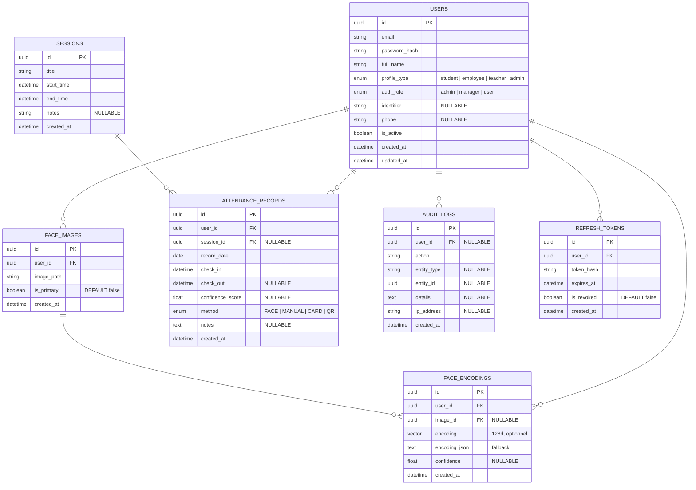

# Schéma — Modèle de reconnaissance faciale dédié à la gestion du pointage et de la présence

> Version ciblée et enrichie. 7 tables, zéro multi-tenant, zéro hiérarchie.

---

## 1. Diagramme MCD



---

## 2. Dictionnaire des Tables

### 2.1 `users` — Utilisateurs

**Rôle :** Toute personne pouvant pointer par reconnaissance faciale.

**Description détaillée :**
Table centrale du système. Chaque ligne représente une personne physique qui interagit avec l'application : étudiant, employé, enseignant, ou administrateur. C'est la table la plus référencée : presque toutes les autres tables pointent vers elle.

**Pourquoi cette table ?**
- Un point d'authentification unique pour tout le monde. Au lieu d'avoir une table `students`, une table `teachers` et une table `admins` avec chacune leur système d'auth, on centralise tout ici.
- `profile_type` distingue la *nature* de la personne (étudiant, employé, enseignant, admin)
- `auth_role` distingue les *permissions* (admin = accès total, manager = gestion des sessions, user = pointage uniquement)
- Ces deux champs sont indépendants : un étudiant peut être `auth_role = admin` (délégué qui gère le système)

**Fusion avec l'ancienne table `profiles` :**
Les champs spécifiques (matricule, téléphone) sont directement dans `users` plutôt que dans une table séparée `profiles`. Cela supprime une jointure systématique et simplifie le modèle.

| Champ | Type | Contraintes | Description |
|-------|------|-------------|-------------|
| id | UUID | PK | |
| email | VARCHAR(255) | NOT NULL, UNIQUE | Email de connexion |
| password_hash | VARCHAR(255) | NOT NULL | Hash bcrypt |
| full_name | VARCHAR(255) | NOT NULL | Nom complet |
| profile_type | ENUM | `student`, `employee`, `teacher`, `admin`, NOT NULL | Nature de la personne |
| auth_role | ENUM | `admin`, `manager`, `user`, NOT NULL | Permission (admin = tout accès, manager = gestion, user = pointage) |
| identifier | VARCHAR(20) | NULLABLE, UNIQUE | Matricule étudiant / employé |
| phone | VARCHAR(20) | NULLABLE | Téléphone |
| is_active | BOOLEAN | DEFAULT `true` | Soft-delete |
| created_at | TIMESTAMPTZ | DEFAULT `now()` | |
| updated_at | TIMESTAMPTZ | DEFAULT `now()` | |

---

### 2.2 `sessions` — Sessions (planning)

**Rôle :** Événements planifiés auxquels les utilisateurs peuvent pointer (cours, réunion, shift).

**Description détaillée :**
Chaque ligne représente un créneau planifié : un cours d'Algèbre le lundi de 8h à 10h, une réunion d'équipe le jeudi de 14h à 15h, un shift d'usine de 6h à 14h. Les pointages (`attendance_records`) peuvent être liés à une session via `session_id`.

**Pourquoi cette table ?**
- Permet de répondre à « Qui était présent au cours d'Algèbre du 10 mars ? » — le pointage est rattaché à un événement précis
- `session_id` NULLABLE dans `attendance_records` : si NULL, c'est un pointage libre (entrée/sortie du campus), si renseigné, c'est un pointage lié à un événement
- Pas de dépendance à une table `activities` ou `rooms` : le titre décrit l'événement, la salle peut être mentionnée dans `notes`

**Tables supprimées et remplacées :**
- `activities` n'existe plus : le titre de la session suffit
- `rooms` n'existe plus : le lieu peut être dans le champ `notes`
- `periods` n'existe plus : les dates de début/fin sont directement sur la session

| Champ | Type | Contraintes | Description |
|-------|------|-------------|-------------|
| id | UUID | PK | |
| title | VARCHAR(255) | NOT NULL | Intitulé (ex: « Cours Algèbre », « Réunion d'équipe ») |
| start_time | TIMESTAMPTZ | NOT NULL | Début |
| end_time | TIMESTAMPTZ | NOT NULL, CHECK(end_time > start_time) | Fin |
| notes | TEXT | NULLABLE | Description ou information complémentaire |
| created_at | TIMESTAMPTZ | DEFAULT `now()` | |

**Index :**
- `INDEX(start_time, end_time)`

---

### 2.3 `face_images` — Images brutes

**Rôle :** Photos originales des utilisateurs, utilisées pour générer les encodages faciaux et pour l'affichage.

**Description détaillée :**
Stocke les chemins vers les photos des utilisateurs. Ces images sont la matière première du système de reconnaissance faciale : elles sont fournies lors de l'enregistrement (inscription) et servent à générer les encodages biométriques stockés dans `face_encodings`.

**Pourquoi cette table ?**
- Séparation claire entre l'image brute (cette table) et le vecteur mathématique extrait (`face_encodings`) : on garde l'originale pour pouvoir ré-extraire un encodage si l'algorithme change
- Plusieurs images par utilisateur : un étudiant peut avoir 3-5 photos sous différents angles pour améliorer la précision
- `is_primary` : une seule image sert d'avatar pour l'affichage (liste des présents, interface d'administration)
- La photo elle-même n'est pas stockée en base (trop volumineuse), seul le chemin l'est ; les fichiers sont sur le disque ou un object storage

| Champ | Type | Contraintes | Description |
|-------|------|-------------|-------------|
| id | UUID | PK | |
| user_id | UUID | FK → `users.id` ON DELETE CASCADE, NOT NULL | |
| image_path | VARCHAR(500) | NOT NULL | Chemin du fichier image |
| is_primary | BOOLEAN | DEFAULT `false` | Image principale (avatar, affichage) |
| created_at | TIMESTAMPTZ | DEFAULT `now()` | |

**Index :**
- `INDEX(user_id, is_primary)`

---

### 2.4 `face_encodings` — Encodages faciaux

**Rôle :** Vecteurs biométriques extraits des images pour la reconnaissance faciale.

**Description détaillée :**
C'est le cœur technique du système. Chaque ligne contient un vecteur mathématique de 128 dimensions (nombre à virgule flottante) qui représente de façon unique le visage d'un utilisateur. Quand une caméra capture un visage, l'algorithme extrait son encodage et le compare à ceux stockés ici pour trouver la correspondance la plus proche.

**Pourquoi cette table ?**
- La recherche par similarité est faite en SQL grâce à l'extension PostgreSQL `pgvector` : `SELECT user_id FROM face_encodings ORDER BY encoding <-> query_vector LIMIT 1`
- `image_id` fait le lien avec l'image brute dans `face_images` : on sait exactement de quelle photo provient chaque encodage
- Deux formats de stockage : `encoding` (VECTOR natif pgvector, performant) et `encoding_json` (TEXT JSON, fallback si pgvector n'est pas installé)
- `confidence` indique la qualité de l'extraction (0-1) : une photo floue ou mal cadrée aura un score bas ; les encodages de mauvaise qualité peuvent être filtrés

**Flux typique :**
1. Un utilisateur s'inscrit → on importe 3 photos dans `face_images`
2. L'algorithme extrait un encodage de chaque photo → 3 lignes dans `face_encodings`
3. Au pointage, la caméra capture un visage → on compare son encodage à tous ceux de la table → match trouvé

| Champ | Type | Contraintes | Description |
|-------|------|-------------|-------------|
| id | UUID | PK | |
| user_id | UUID | FK → `users.id` ON DELETE CASCADE, NOT NULL | |
| image_id | UUID | FK → `face_images.id` ON DELETE SET NULL, NULLABLE | Image source dont est issu cet encodage |
| encoding | VECTOR(128) | NULLABLE | Vecteur pgvector pour recherche de similarité native |
| encoding_json | TEXT | NULLABLE | Fallback JSON pour les bases sans pgvector |
| confidence | FLOAT | NULLABLE | Score de confiance de l'extraction (0-1) |
| created_at | TIMESTAMPTZ | DEFAULT `now()` | |

> **Note :** `encoding` (VECTOR) est l'option recommandée avec l'extension PostgreSQL `pgvector`. `encoding_json` sert de fallback. Au moins un des deux doit être renseigné.

**Index :**
- `INDEX(user_id)`
- `INDEX(image_id)`

---

### 2.5 `attendance_records` — Pointages (table centrale)

**Rôle :** Table la plus importante. Chaque ligne représente une détection de présence.

**Description détaillée :**
Le point d'arrivée de tout le système. Quand la reconnaissance faciale identifie un utilisateur, une ligne est créée ici avec l'heure d'arrivée (`check_in`). Quand l'utilisateur part, `check_out` est renseigné. Cette table est utilisée pour générer tous les rapports de présence, les statistiques d'assiduité et les exports.

**Pourquoi cette table ?**
- Pointage libre vs lié à une session : `session_id` NULL = pointage simple (entrée/sortie libre), `session_id` renseigné = présence à un événement planifié (cours, réunion)
- La contrainte `UNIQUE(user_id, session_id)` empêche un doublon par session (pas deux check-in pour le même cours)
- La contrainte partielle `UNIQUE(user_id, record_date) WHERE session_id IS NULL` autorise un seul pointage libre par jour (un étudiant ne peut pas pointer librement 5 fois le même jour), mais n'empêche pas d'avoir à la fois un pointage libre ET un pointage lié à une session le même jour
- `confidence_score` enregistre le score de confiance retourné par l'algorithme de reconnaissance faciale (utile pour l'audit et le réglage du seuil de détection)
- `method` trace comment le pointage a été effectué : FACE (reconnaissance faciale), MANUAL (admin), CARD (badge), QR (code)

**Dénormalisation :**
`record_date` est stockée séparément de `check_in` pour permettre des index efficaces sur la date seule (rapports quotidiens/mensuels sans extraction SQL de date depuis un timestamp).

| Champ | Type | Contraintes | Description |
|-------|------|-------------|-------------|
| id | UUID | PK | |
| user_id | UUID | FK → `users.id` ON DELETE CASCADE, NOT NULL | Personne pointée |
| session_id | UUID | FK → `sessions.id`, NULLABLE | NULL = pointage libre, renseigné = événement |
| record_date | DATE | NOT NULL | Date du pointage (dénormalisée pour les rapports) |
| check_in | TIMESTAMPTZ | NOT NULL | Heure d'arrivée |
| check_out | TIMESTAMPTZ | NULLABLE | Heure de départ |
| confidence_score | FLOAT | NULLABLE | Score de confiance de la reconnaissance faciale (0-1) |
| method | ENUM | `FACE`, `MANUAL`, `CARD`, `QR`, NOT NULL | Méthode de pointage |
| notes | TEXT | NULLABLE | |
| created_at | TIMESTAMPTZ | DEFAULT `now()` | |

**Contraintes :**
- `UNIQUE(user_id, session_id)` — pas de double pointage par session
- `UNIQUE(user_id, record_date) WHERE session_id IS NULL` — 1 seul pointage libre par jour
- `CHECK(check_out IS NULL OR check_out > check_in)`

**Index :**
- `INDEX(record_date)` — rapports quotidiens/mensuels
- `INDEX(user_id, record_date)` — historique utilisateur
- `INDEX(session_id)` — pointages par session

---

### 2.6 `audit_logs` — Journal d'audit

**Rôle :** Trace toutes les actions importantes (connexion, création/suppression d'utilisateur, modification de pointage).

**Description détaillée :**
Table d'historisation. Chaque ligne représente une action effectuée par un utilisateur dans le système. Elle sert à la sécurité (savoir qui a fait quoi et quand) et au débogage (comprendre comment un état a été atteint).

**Pourquoi cette table ?**
- Conformité et traçabilité : en cas de litige sur un pointage, on peut retrouver qui l'a modifié et quand
- `action` décrit l'opération (LOGIN, LOGOUT, CREATE_USER, UPDATE_USER, DELETE_USER, CREATE_ATTENDANCE, UPDATE_ATTENDANCE, DELETE_ATTENDANCE, etc.)
- `entity_type` et `entity_id` permettent de filtrer les actions liées à une entité spécifique (ex: toutes les modifications sur un pointage précis)
- `details` en JSONB stocke les informations contextuelles (ex: `{"old": {"check_out": null}, "new": {"check_out": "2025-03-10T17:00:00Z"}}`)
- `user_id` NULLABLE : certaines actions sont système (ex: nettoyage automatique des tokens expirés)
- Table en écriture seule : aucune modification ni suppression, les logs sont immuables

| Champ | Type | Contraintes | Description |
|-------|------|-------------|-------------|
| id | UUID | PK | |
| user_id | UUID | FK → `users.id` ON DELETE SET NULL, NULLABLE | NULL si action système |
| action | VARCHAR(50) | NOT NULL | Type d'action (LOGIN, CREATE_USER, DELETE_ATTENDANCE, etc.) |
| entity_type | VARCHAR(50) | NULLABLE | Table concernée (user, session, attendance_record, etc.) |
| entity_id | UUID | NULLABLE | ID de l'entité concernée |
| details | JSONB | NULLABLE | Anciennes/nouvelles valeurs ou informations contextuelles |
| ip_address | VARCHAR(45) | NULLABLE | Adresse IP de l'auteur |
| created_at | TIMESTAMPTZ | DEFAULT `now()` | |

**Index :**
- `INDEX(user_id)`
- `INDEX(action)`
- `INDEX(created_at)`

---

### 2.7 `refresh_tokens` — Tokens de rafraîchissement

**Rôle :** Gestion des sessions API (JWT refresh tokens) pour l'authentification sans mot de passe répété.

**Description détaillée :**
Lorsqu'un utilisateur se connecte, l'API délivre deux tokens JWT : un access token (courte durée, ~15 min) et un refresh token (longue durée, ~7 jours). Le refresh token est stocké ici (hashé) pour pouvoir être révoqué ou validé lors du renouvellement de session.

**Pourquoi cette table ?**
- Sécurité : ne jamais stocker un token en clair — seul le hash est en base ; si la base fuit, les tokens ne peuvent pas être réutilisés
- `expires_at` permet un nettoyage automatique des tokens expirés (cron ou événement)
- `is_revoked` : révoqué manuellement en cas de déconnexion explicite (« logout from all devices ») ou changement de mot de passe
- Un utilisateur peut avoir plusieurs refresh tokens actifs (session web + session mobile) — tous liés à `user_id`

**Cycle de vie d'un token :**
1. Login → création d'un refresh token (hash stocké ici, token brut envoyé au client)
2. Expiration de l'access token → le client envoie le refresh token → on vérifie le hash, qu'il n'est pas expiré ni révoqué → on délivre un nouvel access token
3. Logout → `is_revoked = true` → le refresh token ne peut plus être utilisé
4. Nettoyage : suppression des tokens expirés et révoqués après leur date d'expiration

| Champ | Type | Contraintes | Description |
|-------|------|-------------|-------------|
| id | UUID | PK | |
| user_id | UUID | FK → `users.id` ON DELETE CASCADE, NOT NULL | |
| token_hash | VARCHAR(255) | NOT NULL, UNIQUE | Hash du refresh token (ne jamais stocker le token en clair) |
| expires_at | TIMESTAMPTZ | NOT NULL | Date d'expiration |
| is_revoked | BOOLEAN | DEFAULT `false` | Révoqué manuellement (déconnexion, changement de mot de passe) |
| created_at | TIMESTAMPTZ | DEFAULT `now()` | |

**Index :**
- `INDEX(user_id)`
- `INDEX(token_hash)`

---

## 3. Ce qui a été supprimé et pourquoi

| Table supprimée | Raison |
|---|---|
| `organizations` | Pas de multi-tenant. Système dédié à une seule organisation. |
| `profiles` | Fusionné dans `users` : les champs supplémentaires (identifiant, téléphone) sont directement dans `users`. |
| `organizational_units` | Hiérarchie superflue pour un système de pointage ciblé. |
| `periods` | Les sessions ont des dates de début/fin explicites, pas besoin de période agrégée. |
| `activities` | Simplifié : une session a un titre, pas besoin d'une table activité séparée. |
| `rooms` | Non nécessaire pour le pointage. Peut être un champ texte dans `sessions` si besoin. |
| `groups` | Pas besoin de regroupement (classe/équipe) pour l'import admin. Pointages individuels uniquement. |
| `user_groups` | Table de jonction devenue inutile après la suppression de `groups`. |

---

## 4. Cas d'usage

| Scénario | `sessions` | Pointage |
|---|---|---|
| **Cours universitaire** | title="Algèbre S2", start=08:00, end=10:00 | Lié à la session |
| **Entrée/sortie entreprise** | NULL (pointage libre) | session_id = NULL |
| **Réunion d'équipe** | title="Réunion sprint", start=14:00, end=15:00 | Lié à la session |
| **Shift d'usine** | title="Shift matin", start=06:00, end=14:00 | Lié à la session |

---

## 5. Index de performance

```sql
-- Attendance
CREATE INDEX idx_attendance_date ON attendance_records(record_date);
CREATE INDEX idx_attendance_user_date ON attendance_records(user_id, record_date);
CREATE INDEX idx_attendance_session ON attendance_records(session_id);

-- Sessions
CREATE INDEX idx_sessions_time ON sessions(start_time, end_time);

-- Face
CREATE INDEX idx_face_user ON face_encodings(user_id);
CREATE INDEX idx_face_image ON face_encodings(image_id);
CREATE INDEX idx_face_images_user ON face_images(user_id, is_primary);

-- Audit
CREATE INDEX idx_audit_user ON audit_logs(user_id);
CREATE INDEX idx_audit_action ON audit_logs(action);
CREATE INDEX idx_audit_date ON audit_logs(created_at);

-- Refresh tokens
CREATE INDEX idx_refresh_user ON refresh_tokens(user_id);
CREATE UNIQUE INDEX uq_refresh_token ON refresh_tokens(token_hash);
```

---

## 6. Contraintes d'intégrité

```sql
-- ========== UNICITÉ DES POINTAGES ==========
CREATE UNIQUE INDEX uq_user_session ON attendance_records(user_id, session_id);
CREATE UNIQUE INDEX uq_user_date_free ON attendance_records(user_id, record_date)
    WHERE session_id IS NULL;

-- ========== COHÉRENCE TEMPORELLE ==========
CHECK (check_out IS NULL OR check_out > check_in);
CHECK (end_time > start_time);

-- ========== SOFT-DELETE ==========
-- is_active présent sur : users
```
