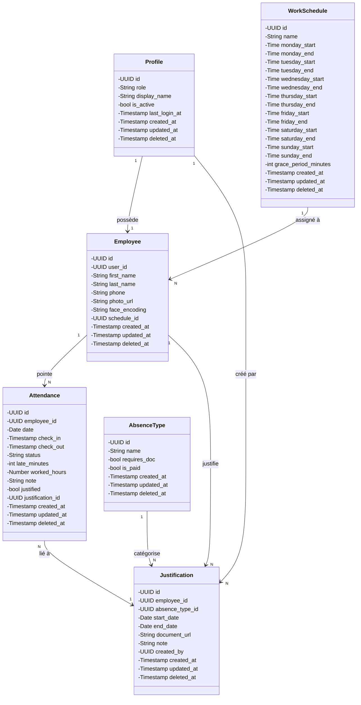

# Structure de la Base de Données

> Système de reconnaissance faciale — Gestion des présences
> PostgreSQL 15+ / Supabase

---

## Conventions générales

- **UUID** pour toutes les clés primaires (`gen_random_uuid()`)
- **Soft delete** — aucun enregistrement supprimé physiquement, `deleted_at` mis à `NULL` par défaut
- **TIMESTAMPTZ** pour toutes les dates/heures
- **TIME** pour les horaires de travail

---

## Tables

### 1. `profiles` — Profils des comptes (liés à Supabase Auth)

Cette table stocke les profils des comptes utilisateur, liés directement à l'authentification Supabase (`auth.users`) via la clé primaire. Le champ `role` détermine les permissions : un `admin` peut gérer les employés et consulter tous les pointages, tandis qu'un `employee` ne peut voir que ses propres données. `display_name` permet d'afficher un nom sans JOIN avec `employees`. `is_active` permet de désactiver un compte sans soft delete.

| Colonne          | Type                  | Contraintes                                       |
|------------------|-----------------------|---------------------------------------------------|
| `id`             | UUID                  | PK, FK → `auth.users(id)` ON DELETE CASCADE       |
| `role`           | TEXT                  | NOT NULL, CHECK(`role` IN ('admin', 'employee'))   |
| `display_name`   | TEXT                  |                                                   |
| `is_active`      | BOOLEAN               | DEFAULT TRUE                                      |
| `last_login_at`  | TIMESTAMPTZ           |                                                   |
| `created_at`     | TIMESTAMPTZ           | DEFAULT `now()`                                   |
| `updated_at`     | TIMESTAMPTZ           | DEFAULT `now()`                                   |
| `deleted_at`     | TIMESTAMPTZ           | DEFAULT NULL                                      |

---

### 2. `employees` — Informations des employés

Cette table contient les informations personnelles et biométriques des employés. Chaque employé est lié à un profil via la clé étrangère `user_id` (relation 1-1). Le champ `face_encoding` stocke le vecteur facial sérialisé (en base64 ou JSON) produit par la librairie `face_recognition` — c'est ce vecteur qui permet d'identifier l'employé lors du pointage par caméra. `photo_url` pointe vers l'image stockée dans Supabase Storage. La colonne `schedule_id` lie l'employé à son planning hebdomadaire (relation N:1 avec `work_schedules`).

| Colonne         | Type                  | Contraintes                        |
|-----------------|-----------------------|------------------------------------|
| `id`            | UUID                  | PK                                 |
| `user_id`       | UUID                  | FK → `profiles(id)`                |
| `first_name`    | TEXT                  | NOT NULL                           |
| `last_name`     | TEXT                  | NOT NULL                           |
| `phone`         | TEXT                  |                                    |
| `photo_url`     | TEXT                  | URL photo stockée Supabase Storage |
| `face_encoding` | TEXT                  | Vecteur facial sérialisé           |
| `schedule_id`   | UUID                  | NOT NULL, FK → `work_schedules(id)` |
| `created_at`    | TIMESTAMPTZ           | DEFAULT `now()`                    |
| `updated_at`    | TIMESTAMPTZ           | DEFAULT `now()`                    |
| `deleted_at`    | TIMESTAMPTZ           | DEFAULT NULL                       |

---

### 3. `work_schedules` — Plannings hebdomadaires

Cette table définit des **plannings hebdomadaires complets** (ex: "Standard Semaine 08:00–17:00 du lundi au vendredi"). Chaque ligne décrit les horaires pour les 7 jours de la semaine. Les colonnes `*_start` / `*_end` sont NULL pour les jours non travaillés. Un employé se voit attribuer un seul planning via la colonne `schedule_id` de la table `employees`.

| Colonne              | Type                  | Contraintes                                    |
|----------------------|-----------------------|------------------------------------------------|
| `id`                 | UUID                  | PK                                             |
| `name`               | TEXT                  | NOT NULL — nom du planning                     |
| `monday_start`       | TIME                  | NULL si repos                                  |
| `monday_end`         | TIME                  | NULL si repos                                  |
| `tuesday_start`      | TIME                  | NULL si repos                                  |
| `tuesday_end`        | TIME                  | NULL si repos                                  |
| `wednesday_start`    | TIME                  | NULL si repos                                  |
| `wednesday_end`      | TIME                  | NULL si repos                                  |
| `thursday_start`     | TIME                  | NULL si repos                                  |
| `thursday_end`       | TIME                  | NULL si repos                                  |
| `friday_start`       | TIME                  | NULL si repos                                  |
| `friday_end`         | TIME                  | NULL si repos                                  |
| `saturday_start`     | TIME                  | NULL si repos                                  |
| `saturday_end`       | TIME                  | NULL si repos                                  |
| `sunday_start`       | TIME                  | NULL si repos                                  |
| `sunday_end`         | TIME                  | NULL si repos                                  |
| `grace_period_minutes` | INTEGER             | DEFAULT 10 — tolérance de retard en minutes    |
| `created_at`         | TIMESTAMPTZ           | DEFAULT `now()`                                |
| `updated_at`         | TIMESTAMPTZ           | DEFAULT `now()`                                |
| `deleted_at`         | TIMESTAMPTZ           | DEFAULT NULL                                   |

---

### 4. `attendance` — Pointages quotidiens

Cette table enregistre les pointages d'entrée et de sortie de chaque employé pour chaque jour. La contrainte `UNIQUE(employee_id, date)` garantit qu'il ne peut y avoir qu'un seul enregistrement par employé et par jour. Le `status` est calculé automatiquement (ou saisi) selon l'heure d'arrivée par rapport à l'horaire prévu dans `work_schedules` : `present` si dans les temps (ou pendant la grâce), `late` si au-delà, `absent` si pas de pointage. Les champs `late_minutes` et `worked_hours` sont dérivés des timestamps `check_in`/`check_out`.

| Colonne         | Type                  | Contraintes                                       |
|-----------------|-----------------------|---------------------------------------------------|
| `id`            | UUID                  | PK                                                |
| `employee_id`   | UUID                  | FK → `employees(id)`                              |
| `date`          | DATE                  | NOT NULL                                          |
| `check_in`      | TIMESTAMPTZ           |                                                   |
| `check_out`     | TIMESTAMPTZ           |                                                   |
| `status`        | TEXT                  | CHECK(`status` IN ('present', 'late', 'absent')), DEFAULT 'absent' |
| `late_minutes`  | INTEGER               | DEFAULT 0                                         |
| `worked_hours`  | NUMERIC(5,2)          | DEFAULT 0                                         |
| `note`          | TEXT                  |                                                   |
| `justified`     | BOOLEAN               | DEFAULT FALSE — justifié par un admin             |
| `justification_id` | UUID               | FK → `justifications(id)` — lien vers le justificatif |
| `created_at`    | TIMESTAMPTZ           | DEFAULT `now()`                                   |
| `updated_at`    | TIMESTAMPTZ           | DEFAULT `now()`                                   |
| `deleted_at`    | TIMESTAMPTZ           | DEFAULT NULL                                      |

**Contrainte unique :** UNIQUE(`employee_id`, `date`) — un seul pointage par employé par jour

---

### 5. `absence_types` — Catégories d'absence

Cette table liste les types d'absence possibles (Maladie, Congé payé, Motif familial, Formation, Autre). Elle permet à l'admin de choisir le type lors de la saisie d'un justificatif. Le champ `requires_doc` indique si un document justificatif est requis, et `is_paid` précise si l'absence est rémunérée.

| Colonne         | Type                  | Contraintes                                    |
|-----------------|-----------------------|------------------------------------------------|
| `id`            | UUID                  | PK                                             |
| `name`          | TEXT                  | NOT NULL, UNIQUE — nom du type d'absence       |
| `requires_doc`  | BOOLEAN               | DEFAULT FALSE                                  |
| `is_paid`       | BOOLEAN               | DEFAULT TRUE                                   |
| `created_at`    | TIMESTAMPTZ           | DEFAULT `now()`                                |
| `updated_at`    | TIMESTAMPTZ           | DEFAULT `now()`                                |
| `deleted_at`    | TIMESTAMPTZ           | DEFAULT NULL                                   |

---

### 6. `justifications` — Justificatifs d'absence

Cette table stocke les justificatifs d'absence saisis par l'admin. Chaque justificatif est lié à un employé, un type d'absence (`absence_types`), et peut couvrir une période de plusieurs jours (`start_date` → `end_date`). `document_url` pointe vers le scan dans Supabase Storage. `created_by` référence l'admin qui a saisi le justificatif. La colonne `justification_id` dans `attendance` fait le lien avec les pointages concernés.

| Colonne           | Type                  | Contraintes                                    |
|-------------------|-----------------------|------------------------------------------------|
| `id`              | UUID                  | PK                                             |
| `employee_id`     | UUID                  | NOT NULL, FK → `employees(id)`                 |
| `absence_type_id` | UUID                  | NOT NULL, FK → `absence_types(id)`             |
| `start_date`      | DATE                  | NOT NULL — début de l'absence                  |
| `end_date`        | DATE                  | NOT NULL — fin de l'absence                    |
| `document_url`    | TEXT                  | URL du scan dans Supabase Storage              |
| `note`            | TEXT                  | Commentaire de l'admin                         |
| `created_by`      | UUID                  | NOT NULL, FK → `profiles(id)` — admin qui saisit |
| `created_at`      | TIMESTAMPTZ           | DEFAULT `now()`                                |
| `updated_at`      | TIMESTAMPTZ           | DEFAULT `now()`                                |
| `deleted_at`      | TIMESTAMPTZ           | DEFAULT NULL                                   |

**Contrainte :** CHECK(`end_date` >= `start_date`) — la période doit être valide

---

## Index de performance

| Index                         | Table                 | Colonnes                       | Filtre               |
|-------------------------------|-----------------------|--------------------------------|----------------------|
| `idx_employees_user_id`       | `employees`           | `user_id`                      |                      |
| `idx_employees_schedule_id`   | `employees`           | `schedule_id`                  |                      |
| `idx_attendance_emp_date`     | `attendance`          | `employee_id`, `date`          |                      |
| `idx_attendance_date`         | `attendance`          | `date`                         |                      |
| `idx_attendance_status`       | `attendance`          | `status`                       |                      |
| `idx_attendance_justified`    | `attendance`          | `justified`                    | `WHERE justified = TRUE` |
| `idx_justifications_employee` | `justifications`      | `employee_id`                  |                      |
| `idx_justifications_dates`    | `justifications`      | `start_date`, `end_date`       |                      |

---

## Diagrammes

### Diagramme de classes (UML)

Ce diagramme représente la structure statique du système sous forme de classes avec leurs attributs et relations. Chaque classe correspond à une table de la base de données. Les attributs sont typés (UUID, String, Timestamp, etc.) et la visibilité est privée (`-`). Les relations indiquent les cardinalités :
- **Profile 1 → 1 Employee** : un profil possède un et un seul employé
- **WorkSchedule 1 → N Employee** : un planning hebdomadaire peut être assigné à plusieurs employés
- **Employee 1 → N Attendance** : un employé a plusieurs pointages (un par jour travaillé)
- **Employee 1 → N Justification** : un employé peut avoir plusieurs justificatifs
- **Admin → N Justification** : un admin crée plusieurs justificatifs



### Modèle Conceptuel de Données (MCD — Merise)

Ce diagramme conceptuel (indépendant de toute implémentation technique) décrit les entités et leurs relations selon la notation Merise (Pascal Chen). Les cardinalités se lisent comme suit :
- **PROFILE ||--|| EMPLOYEE** : un PROFILE a au moins un et au plus un EMPLOYEE (relation 1-1 totale)
- **WORK_SCHEDULE ||--o{ EMPLOYEE** : un WORK_SCHEDULE peut être assigné à plusieurs employés (relation 1-N)
- **EMPLOYEE ||--o{ ATTENDANCE** : un EMPLOYEE a plusieurs ATTENDANCE (relation 1-N totale côté employé, optionnelle côté pointage)
- **EMPLOYEE ||--o{ JUSTIFICATION** : un EMPLOYEE peut avoir plusieurs JUSTIFICATION
- **ABSENCE_TYPE ||--o{ JUSTIFICATION** : un ABSENCE_TYPE catégorise plusieurs JUSTIFICATION
- **ATTENDANCE o--|| JUSTIFICATION** : une ATTENDANCE peut être liée à une JUSTIFICATION

Les attributs clés (`PK`, `FK`, `UK`) sont indiqués pour chaque entité.

```mermaid
erDiagram
    PROFILE ||--|| EMPLOYEE : "possède"
    WORK_SCHEDULE ||--o{ EMPLOYEE : "assigné à"
    EMPLOYEE ||--o{ ATTENDANCE : "pointe"
    EMPLOYEE ||--o{ JUSTIFICATION : "justifie"
    ABSENCE_TYPE ||--o{ JUSTIFICATION : "catégorise"
    ATTENDANCE o--|| JUSTIFICATION : "lie a"

    PROFILE {
        uuid id PK
        string role
        string display_name
        bool is_active
        timestamp last_login_at
    }

    EMPLOYEE {
        uuid id PK
        uuid user_id FK
        string first_name
        string last_name
        string phone
        string photo_url
        string face_encoding
        uuid schedule_id FK
    }

    WORK_SCHEDULE {
        uuid id PK
        string name
        time monday_start
        time monday_end
        time tuesday_start
        time tuesday_end
        time wednesday_start
        time wednesday_end
        time thursday_start
        time thursday_end
        time friday_start
        time friday_end
        time saturday_start
        time saturday_end
        time sunday_start
        time sunday_end
        int grace_period_minutes
    }

    ATTENDANCE {
        uuid id PK
        uuid employee_id FK
        date date
        timestamp check_in
        timestamp check_out
        string status
        int late_minutes
        numeric worked_hours
        string note
        bool justified
        uuid justification_id FK
    }

    ABSENCE_TYPE {
        uuid id PK
        string name
        bool requires_doc
        bool is_paid
    }

    JUSTIFICATION {
        uuid id PK
        uuid employee_id FK
        uuid absence_type_id FK
        date start_date
        date end_date
        string document_url
        string note
        uuid created_by FK
    }
```

---

## Logique de gestion des absences

### 1. Détection d'absence (automatique)

```
Chaque jour à une heure fixe (ex: 23h59) → un job/script s'exécute
    ↓
Pour chaque employé :
    ↓
Regarder son planning (work_schedules) pour ce jour
    ├─ Si le jour est NULL (week-end/repos) → ignorer, pas d'absence
    └─ Si le jour est travaillé (ex: monday_start = '08:00') :
           ├─ Vérifier si un enregistrement attendance existe pour ce jour
           │   ├─ OUI → rien à faire (déjà marqué present/late/absent)
           │   └─ NON → Créer une entrée : status = 'absent', justified = FALSE
           └─ Fin
```

### 2. Logique des statuts dans `attendance`

| Situation | `status` | `justified` | Signification |
|---|---|---|---|
| Employé a pointé à l'heure | `present` | `false` | Normal |
| Employé pointé en retard (> grace_period) | `late` | `false` | Retard non justifié |
| Employé pointé en retard mais a un motif | `late` | `true` | Retard justifié (ex: embouteillage) |
| Aucun pointage, jour travaillé | `absent` | `false` | Absence non justifiée |
| Aucun pointage, mais justificatif fourni | `absent` | `true` | Absence justifiée (maladie...) |
| Jour non travaillé (week-end) | Pas d'entrée | - | Ignoré |

### 3. Logique de justification (par l'admin)

```
L'employé donne un justificatif papier à l'admin
    ↓
L'admin se connecte → va sur l'interface "Justifier une absence"
    ↓
Sélectionne : employé + date(s) + type (maladie/familial/...) + upload scan
    ↓
Backend :
    1. Crée une entrée dans justifications
    2. Met à jour attendance.justified = TRUE
       (et lie l'ID de la justification)
```

---

## Données de test (résumé)

| Table                | Contenu                                                  |
|----------------------|----------------------------------------------------------|
| `profiles`           | 1 admin, 1 employee                                      |
| `work_schedules`     | 2 plannings hebdomadaires : Standard (08:00–17:00), Flex (09:00–18:00 / 13:00–21:00) |
| `employees`          | Ahmed Benali → Standard, Sara Dupont → Flex              |
| `attendance`         | 5 derniers jours ouvrés pour chaque employé              |
| `absence_types`      | 5 types : Maladie, Congé payé, Motif familial, Formation, Autre |
| `justifications`     | 1 justificatif (Ahmed — maladie, certif. médical fourni) |
