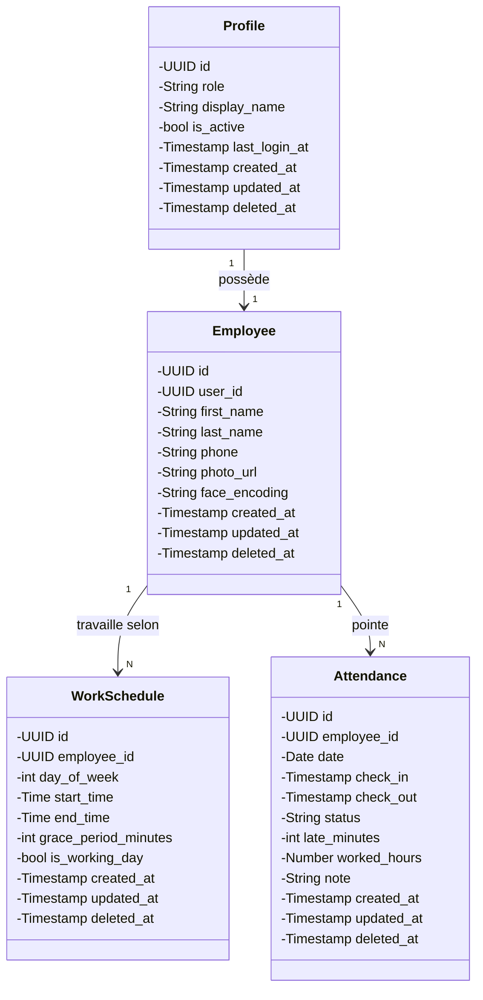
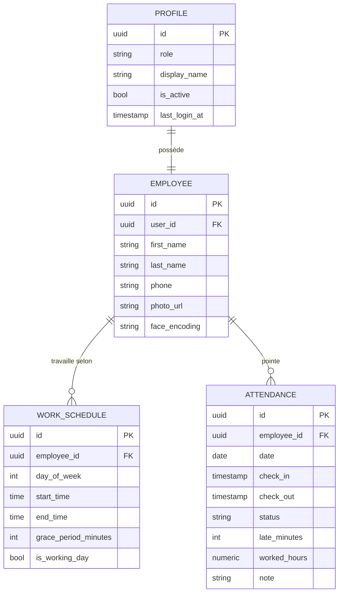

# Structure de la Base de Données

> Système de reconnaissance faciale — Gestion des présences
> PostgreSQL 15+ / Supabase

---

## Conventions générales

- **UUID** pour toutes les clés primaires (`gen_random_uuid()`)
- **Soft delete** — aucun enregistrement supprimé physiquement, `deleted_at` mis à `NULL` par défaut
- **TIMESTAMPTZ** pour toutes les dates/heures
- **TIME** pour les horaires de travail

---

## Tables

### 1. `profiles` — Profils des comptes (liés à Supabase Auth)

Cette table stocke les profils des comptes utilisateur, liés directement à l'authentification Supabase (`auth.users`) via la clé primaire. Le champ `role` détermine les permissions : un `admin` peut gérer les employés et consulter tous les pointages, tandis qu'un `employee` ne peut voir que ses propres données. `display_name` permet d'afficher un nom sans JOIN avec `employees`. `is_active` permet de désactiver un compte sans soft delete.

| Colonne          | Type                  | Contraintes                                       |
|------------------|-----------------------|---------------------------------------------------|
| `id`             | UUID                  | PK, FK → `auth.users(id)` ON DELETE CASCADE       |
| `role`           | TEXT                  | NOT NULL, CHECK(`role` IN ('admin', 'employee'))   |
| `display_name`   | TEXT                  |                                                   |
| `is_active`      | BOOLEAN               | DEFAULT TRUE                                      |
| `last_login_at`  | TIMESTAMPTZ           |                                                   |
| `created_at`     | TIMESTAMPTZ           | DEFAULT `now()`                                   |
| `updated_at`     | TIMESTAMPTZ           | DEFAULT `now()`                                   |
| `deleted_at`     | TIMESTAMPTZ           | DEFAULT NULL                                      |

---

### 2. `employees` — Informations des employés

Cette table contient les informations personnelles et biométriques des employés. Chaque employé est lié à un profil via la clé étrangère `user_id` (relation 1-1). Le champ `face_encoding` stocke le vecteur facial sérialisé (en base64 ou JSON) produit par la librairie `face_recognition` — c'est ce vecteur qui permet d'identifier l'employé lors du pointage par caméra. `photo_url` pointe vers l'image stockée dans Supabase Storage.

| Colonne         | Type                  | Contraintes                        |
|-----------------|-----------------------|------------------------------------|
| `id`            | UUID                  | PK                                 |
| `user_id`       | UUID                  | FK → `profiles(id)`                |
| `first_name`    | TEXT                  | NOT NULL                           |
| `last_name`     | TEXT                  | NOT NULL                           |
| `phone`         | TEXT                  |                                    |
| `photo_url`     | TEXT                  | URL photo stockée Supabase Storage |
| `face_encoding` | TEXT                  | Vecteur facial sérialisé           |
| `created_at`    | TIMESTAMPTZ           | DEFAULT `now()`                    |
| `updated_at`    | TIMESTAMPTZ           | DEFAULT `now()`                    |
| `deleted_at`    | TIMESTAMPTZ           | DEFAULT NULL                       |

---

### 3. `work_schedules` — Emplois du temps personnalisés

Cette table définit les horaires de travail pour chaque employé, jour par jour. Un employé peut avoir des horaires différents selon le jour de la semaine (ex. : journée longue le lundi, demi-journée le mardi). Le champ `grace_period_minutes` fixe une tolérance de retard propre à chaque créneau. Si `is_working_day` est `FALSE`, l'employé est en repos ce jour-là. La combinaison `(employee_id, day_of_week)` est implicitement unique via une contrainte d'index.

| Colonne              | Type                  | Contraintes                                       |
|----------------------|-----------------------|---------------------------------------------------|
| `id`                 | UUID                  | PK                                                |
| `employee_id`        | UUID                  | FK → `employees(id)`                              |
| `day_of_week`        | INTEGER               | NOT NULL, CHECK(0–6) — 0=Lundi, 6=Dimanche        |
| `start_time`         | TIME                  | NOT NULL                                          |
| `end_time`           | TIME                  | NOT NULL                                          |
| `grace_period_minutes` | INTEGER             | DEFAULT 10 — tolérance de retard en minutes       |
| `is_working_day`     | BOOLEAN               | DEFAULT TRUE — FALSE si repos                     |
| `created_at`         | TIMESTAMPTZ           | DEFAULT `now()`                                   |
| `updated_at`         | TIMESTAMPTZ           | DEFAULT `now()`                                   |
| `deleted_at`         | TIMESTAMPTZ           | DEFAULT NULL                                      |

---

### 4. `attendance` — Pointages quotidiens

Cette table enregistre les pointages d'entrée et de sortie de chaque employé pour chaque jour. La contrainte `UNIQUE(employee_id, date)` garantit qu'il ne peut y avoir qu'un seul enregistrement par employé et par jour. Le `status` est calculé automatiquement (ou saisi) selon l'heure d'arrivée par rapport à l'horaire prévu dans `work_schedules` : `present` si dans les temps (ou pendant la grâce), `late` si au-delà, `absent` si pas de pointage. Les champs `late_minutes` et `worked_hours` sont dérivés des timestamps `check_in`/`check_out`.

| Colonne         | Type                  | Contraintes                                       |
|-----------------|-----------------------|---------------------------------------------------|
| `id`            | UUID                  | PK                                                |
| `employee_id`   | UUID                  | FK → `employees(id)`                              |
| `date`          | DATE                  | NOT NULL                                          |
| `check_in`      | TIMESTAMPTZ           |                                                   |
| `check_out`     | TIMESTAMPTZ           |                                                   |
| `status`        | TEXT                  | CHECK(`status` IN ('present', 'late', 'absent')), DEFAULT 'absent' |
| `late_minutes`  | INTEGER               | DEFAULT 0                                         |
| `worked_hours`  | NUMERIC(5,2)          | DEFAULT 0                                         |
| `note`          | TEXT                  |                                                   |
| `created_at`    | TIMESTAMPTZ           | DEFAULT `now()`                                   |
| `updated_at`    | TIMESTAMPTZ           | DEFAULT `now()`                                   |
| `deleted_at`    | TIMESTAMPTZ           | DEFAULT NULL                                      |

**Contrainte unique :** UNIQUE(`employee_id`, `date`) — un seul pointage par employé par jour

---

## Index de performance

| Index                         | Table             | Colonnes                       |
|-------------------------------|-------------------|--------------------------------|
| `idx_employees_user_id`       | `employees`       | `user_id`                      |
| `idx_work_schedules_emp_day`  | `work_schedules`  | `employee_id`, `day_of_week`   |
| `idx_attendance_emp_date`     | `attendance`      | `employee_id`, `date`          |
| `idx_attendance_date`         | `attendance`      | `date`                         |
| `idx_attendance_status`       | `attendance`      | `status`                       |

---

## Diagrammes

### Diagramme de classes (UML)

Ce diagramme représente la structure statique du système sous forme de classes avec leurs attributs et relations. Chaque classe correspond à une table de la base de données. Les attributs sont typés (UUID, String, Timestamp, etc.) et la visibilité est privée (`-`). Les relations indiquent les cardinalités :
- **Profile 1 → 1 Employee** : un profil possède un et un seul employé
- **Employee 1 → N WorkSchedule** : un employé peut avoir plusieurs créneaux horaires (un par jour de semaine)
- **Employee 1 → N Attendance** : un employé a plusieurs pointages (un par jour travaillé)

### Modèle Conceptuel de Données (MCD — Merise)

Ce diagramme conceptuel (indépendant de toute implémentation technique) décrit les entités et leurs relations selon la notation Merise (Pascal Chen). Les cardinalités se lisent comme suit :
- **PROFILE ||--|| EMPLOYEE** : un PROFILE a au moins un et au plus un EMPLOYEE (relation 1-1 totale)
- **EMPLOYEE ||--o{ WORK_SCHEDULE** : un EMPLOYEE a au moins un et plusieurs WORK_SCHEDULE (relation 1-N totale côté employé, optionnelle côté emploi du temps)
- **EMPLOYEE ||--o{ ATTENDANCE** : un EMPLOYEE a au moins un et plusieurs ATTENDANCE (relation 1-N totale côté employé, optionnelle côté pointage)

Les attributs clés (`PK`, `FK`, `UK`) sont indiqués pour chaque entité.

---

## Données de test (résumé)

| Table            | Contenu                                    |
|------------------|--------------------------------------------|
| `profiles`       | 1 admin, 1 employee                        |
| `employees`      | Ahmed Benali (admin), Sara Dupont (employee) |
| `work_schedules` | Ahmed : Lun-Ven 08:00–17:00                |
|                  | Sara : Lun/Mer/Ven 09:00–18:00, Mar/Jeu 13:00–21:00 |
| `attendance`     | 5 derniers jours ouvrés pour chaque employé |
